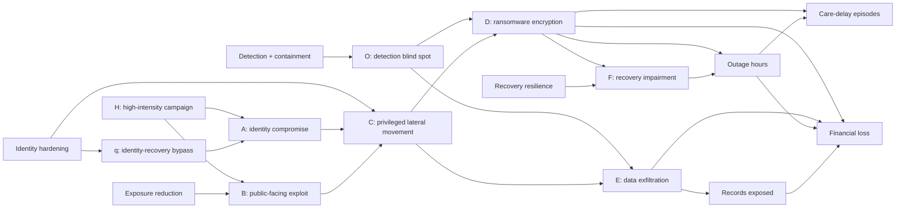
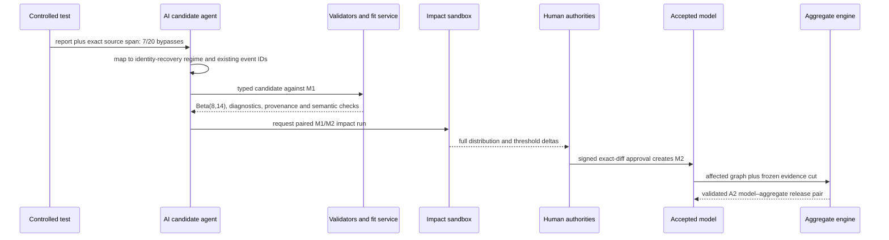

# Cyber Risk Management Worked Example

## Ransomware and data exfiltration at a regional health service

- **Status:** synthetic teaching example; not an assessment of any real organisation
- **Horizon:** one year
- **Decision:** which control programme brings a four-dimensional loss distribution within an illustrative risk appetite after new identity-control evidence is accepted?
- **Model:** the Modular Bayesian Generative Risk Graph specified in the [Ground Risk research report](ground-risk-research-report.md)
- **Reproduction:** [`examples/cyber-risk/simulate.py`](../examples/cyber-risk/simulate.py)

> **Do not reuse these numbers.** Every asset, event, probability, loss distribution, test result, threshold and organisation below is fictional. The standards and threat-knowledge sources are real; they provide semantics and process guidance, not the numerical inputs in this example.

## 1. Decision outcome first

Rivergate Health Service (RHS) is a fictional 450-bed regional health service with four outpatient clinics, about 5,000 workforce identities, a cloud identity provider, an electronic health record, imaging and pharmacy systems, an internet-facing remote-access gateway, and a secondary recovery environment.

RHS has just tested a new help-desk identity-recovery process. Seven of 20 controlled social-engineering attempts bypassed its intended phishing-resistant authentication. The accepted pre-test model described the old process, so the result creates a **new-regime candidate**, not a retrospective edit of the old data.

The impact run finds that accepting the new regime approximately doubles the modelled annual financial tail and more than doubles several operational threshold probabilities:

| Metric | M1: old process | M2: tested process | Change |
|---|---:|---:|---:|
| Mean identity-bypass parameter | 10.007% | 36.377% | +26.370 percentage points |
| Annual identity compromise | 4.010% | 13.435% | +9.425 percentage points |
| Lateral movement | 3.321% | 6.965% | +3.644 percentage points |
| Material ransomware or exfiltration incident | 2.075% | 4.325% | +2.250 percentage points |
| Expected financial loss | A$0.100M | A$0.209M | +A$0.109M (+108%) |
| Financial ES, worst 5% | A$2.008M | A$4.186M | +A$2.178M (+108%) |
| P(financial loss ≥ A$5M) | 0.707% | 1.473% | +0.766 percentage points |
| P(critical-service outage ≥24 h) | 0.570% | 1.182% | +0.612 percentage points |
| P(records exposed ≥10,000) | 0.949% | 1.985% | +1.037 percentage points |
| P(care-delay episodes ≥50) | 1.475% | 3.080% | +1.605 percentage points |

Under the deliberately strict, synthetic appetite in section 2, no single control treatment passes all four loss constraints. The combined identity, exposure, detection and recovery programme does. This is a **risk-model result, not yet an investment decision**: RHS would still need real implementation costs, capacity, legal obligations, clinical-safety review and independent model validation.

The worked example demonstrates five conclusions from the research:

1. attack entries and consequences are generated jointly rather than added as independent risk-register scores;
2. unlike financial, service, privacy and care consequences remain a vector;
3. external vulnerability scores inform evidence but do not become organisational risk probabilities automatically;
4. an AI agent can construct and explain a candidate, while accepted parameters and aggregates come from governed tools and people; and
5. provisional stream updates reconcile to a frozen-cut batch run before a release becomes authoritative.

## 2. Scope, objectives and risk appetite

### 2.1 Business scope

The model covers one annual operating period and these assets:

| Asset or process | Exposure represented in the model | Primary objective |
|---|---|---|
| Workforce identity and help-desk recovery | 5,000 identities, privileged recovery workflow and authentication controls | Prevent unauthorised access and contain credential compromise |
| Internet remote-access gateway | One externally reachable service and its patch/configuration state | Prevent exploit-based entry |
| Clinical application environment | EHR, imaging and pharmacy services behind common identity and network controls | Preserve availability and integrity |
| Security monitoring and response | Identity, endpoint, network and cloud telemetry plus incident-response processes | Detect and contain lateral movement |
| Backup and recovery environment | Isolated copies, restore workflow and recovery staff | Restore critical services after encryption |
| Patient and workforce information | Records reachable from the modelled clinical environment | Prevent unauthorised disclosure |

The example uses the NIST Cybersecurity Framework 2.0 as an outcome vocabulary across **Govern, Identify, Protect, Detect, Respond and Recover**; NIST describes the CSF as a taxonomy for managing and communicating cybersecurity risk rather than a prescription for one implementation ([NIST CSWP 29](https://doi.org/10.6028/NIST.CSWP.29), standard/guidance). NIST SP 800-30 supplies the general risk-assessment process, and NIST IR 8286 Rev. 1 connects cybersecurity risk information to enterprise objectives and decisions ([NIST SP 800-30 Rev. 1](https://doi.org/10.6028/NIST.SP.800-30r1), standard/guidance; [NIST IR 8286 Rev. 1](https://csrc.nist.gov/pubs/ir/8286/r1/final), standard/guidance).

### 2.2 Loss vector

The authoritative aggregate is

\[
\mathbf L =
\left(
L_{\text{financial}},
L_{\text{outage}},
L_{\text{records}},
L_{\text{care-delay}}
\right),
\]

where:

- \(L_{\text{financial}}\) is direct, commensurable loss in A$ millions;
- \(L_{\text{outage}}\) is critical-service disruption in hours;
- \(L_{\text{records}}\) is the number of records exposed; and
- \(L_{\text{care-delay}}\) is the number of care-delay episodes associated with disruption.

The model does **not** add an outage hour, a record and a care delay to a dollar. Financial response, rebuild, interruption and privacy-response costs can be added because they share a declared unit and valuation basis. The original non-financial dimensions remain available even when a financial component depends on them.

### 2.3 Illustrative board constraints

RHS uses component constraints rather than a hidden weighted score:

| Loss constraint | Illustrative annual limit |
|---|---:|
| \(P(L_{\text{financial}}\geq\text{A$5M})\) | ≤0.25% |
| \(P(L_{\text{outage}}\geq24\text{ h})\) | ≤0.20% |
| \(P(L_{\text{records}}\geq10{,}000)\) | ≤0.30% |
| \(P(L_{\text{care-delay}}\geq50)\) | ≤0.50% |

These limits are fictional. A real health service would require board-approved risk appetite, clinical-safety governance, privacy/legal advice and jurisdiction-specific obligations. Passing them does not prove a system is safe; failing one requires treatment, explicit acceptance or another authorised response.

## 3. Evidence and semantic boundary

### 3.1 What each source can establish

| Evidence | Legitimate model use | What it cannot establish by itself |
|---|---|---|
| Asset/configuration inventory | Whether a system, version, exposure and control apply to RHS | Attack probability, control effectiveness or loss |
| Controlled security test | A likelihood for the tested control and regime, with sampling uncertainty | Annual compromise frequency without a threat-opportunity model |
| Internal incident/telemetry history | Organisation-specific attempts, detections, paths and timing under its observation process | Unobserved attacks or future stationarity |
| Threat intelligence | Threat actor activity, techniques, campaigns and observed exploitation | A complete RHS loss distribution |
| CVSS v4.0 | Technical characteristics and severity of a vulnerability | Portfolio or organisational risk; FIRST explicitly states that the CVSS Base score measures severity, not risk ([FIRST CVSS v4.0 User Guide](https://www.first.org/cvss/v4.0/user-guide), standard/guidance) |
| EPSS | Probability that exploitation activity for a CVE will be observed in the wild in the next 30 days | RHS-specific control, exposure or impact; FIRST says EPSS is not a complete risk picture ([FIRST EPSS FAQ](https://www.first.org/epss/faq), model documentation) |
| CISA Known Exploited Vulnerabilities | Evidence that a listed CVE meets CISA's active-exploitation criteria and merits prioritised remediation | Certainty that RHS will be compromised or the magnitude of consequence ([CISA KEV Catalog](https://www.cisa.gov/known-exploited-vulnerabilities-catalog), authoritative operational source) |
| MITRE ATT&CK | Stable vocabulary for adversary goals and techniques based on observed activity | Frequencies, causal certainty or financial loss ([MITRE ATT&CK](https://attack.mitre.org/), authoritative knowledge base) |

The vulnerability workflow therefore uses CVSS, EPSS and KEV as **different evidence fields**, never as interchangeable risk scores. A KEV listing supersedes a pre-threat EPSS estimate as evidence of active exploitation, but the organisation-specific entry kernel still conditions on asset presence, reachability, control state and time.

### 3.2 Missingness

RHS distinguishes:

- `observed_zero`: a control generated a valid observation and saw no event;
- `not_collected`: the required telemetry was absent;
- `censored`: the event may have started before the retained log window;
- `below_detection`: the source cannot see the technique reliably;
- `not_applicable`: the asset or technique does not apply; and
- `unknown`: the system cannot yet distinguish the reason.

For example, a gateway with no retained exploit telemetry is `not_collected`, not “zero exploit attempts.” The detection-blind-spot node below explicitly represents the chance that downstream activity is not contained; missing monitoring data also widens model uncertainty rather than lowering occurrence probability.

## 4. Generative cyber-risk graph



The ATT&CK labels used for navigation are candidate mappings, not probability edges: identity entry includes Phishing and Valid Accounts ([T1566](https://attack.mitre.org/techniques/T1566/), [T1078](https://attack.mitre.org/techniques/T1078/)); public entry includes Exploit Public-Facing Application ([T1190](https://attack.mitre.org/techniques/T1190/)); the path can include Exploitation for Privilege Escalation and Remote Services ([T1068](https://attack.mitre.org/techniques/T1068/), [T1021](https://attack.mitre.org/techniques/T1021/)); and the modelled outcomes include Data Encrypted for Impact and exfiltration ([T1486](https://attack.mitre.org/techniques/T1486/), [T1041](https://attack.mitre.org/techniques/T1041/)). A domain expert validates each mapping and whether it is computational, informational or merely similar.

### 4.1 Primitive occurrence identity

The risk register may show “ransomware through credentials,” “ransomware through gateway exploitation” and “clinical outage.” The graph does not create three independent ransomware events. It stores one primitive ransomware event \(D\), with alternative entry paths through \(A\) and \(B\), and one outage consequence generated from \(D\) and \(F\). Views reference the same identifiers.

Likewise, the campaign \(H\) is a cause, not another loss to add. It is sampled once per simulated year and conditions both entry events. The detection blind spot \(O\) is sampled once and conditions ransomware and exfiltration. These shared draws preserve clustering.

## 5. Accepted model M1 and candidate model M2

### 5.1 Occurrence and control kernels

All parameters in this table are synthetic.

| Node | M1 / M2 model | Interpretation |
|---|---|---|
| Campaign \(H\) | \(H\sim\mathrm{Bernoulli}(0.18)\) | Annual high-intensity threat state shared by both entries |
| Identity bypass \(q\), M1 | \(q\sim\mathrm{Beta}(3,27)\) | Old regime: uniform prior plus 2 bypasses and 26 resisted attempts |
| Identity bypass \(q\), M2 | \(q\sim\mathrm{Beta}(8,14)\) | New regime: uniform prior plus 7 bypasses and 13 resisted attempts |
| Identity attempts | \(\lambda_H=1.20,\lambda_{\neg H}=0.25\) | Annual Poisson opportunity rate |
| Identity entry \(A\) | \(P(A=1\mid H,q)=1-e^{-\lambda_Hq}\) | Poisson thinning: at least one successful identity attack |
| Public exploit \(B\) | \(P(B=1\mid H)=0.14; P(B=1\mid\neg H)=0.03\) | Environment-specific annual entry kernel |
| Lateral movement \(C\) | 0.58 if A+B; 0.40 if A only; 0.32 if B only; 0.002 otherwise | Entry paths converge at one privileged-movement event |
| Detection blind spot \(O\) | \(O\sim\mathrm{Bernoulli}(0.18)\) | Common containment weakness for D and E |
| Ransomware \(D\mid C\) | 0.62 if O else 0.38, plus 0.06 in H; capped at 0.95 | Encryption/impact conditional on established movement |
| Exfiltration \(E\mid C\) | 0.52 if O else 0.26, plus 0.05 in H; capped at 0.95 | Data theft conditional on established movement |
| Recovery impairment \(F\mid D\) | 0.28 | Backup/restore path materially impaired |

The posterior-predictive identity bypass distributions make the regime change explicit:

| Regime | Mean | 5th percentile | Median | 95th percentile |
|---|---:|---:|---:|---:|
| M1 old help-desk process, Beta(3,27) | 10.007% | 2.887% | 9.122% | 20.162% |
| M2 tested process, Beta(8,14) | 36.377% | 20.599% | 35.958% | 53.601% |
| Remediated process, Beta(1,25) | 3.851% | 0.206% | 2.739% | 11.298% |

The remediation posterior comes from a third synthetic regime: a uniform prior and 0 bypasses in 24 controlled attempts. Zero observed bypasses does not set the probability to zero.

### 5.2 Why this is a model replacement, not a posterior update from M1

M1 and M2 describe different help-desk processes. Updating Beta(3,27) with the M2 test would assert exchangeability across old and new configurations, which the process change contradicts. The candidate therefore carries:

- the old and new regime identifiers;
- the exact test dataset and observation protocol;
- the Beta(1,1) prior approved for the new controlled-test regime;
- the mapping from test bypass to annual compromise through the Poisson opportunity model;
- applicability and expiry; and
- a requirement for identity-owner, quantitative-validator and model-owner approval.

An LLM can extract the “7 of 20” claim and map it to the help-desk control, but only the statistical tool creates Beta(8,14), runs diagnostics and propagates the change.

## 6. Loss kernels

### 6.1 Service, privacy and care consequences

| Loss component | Conditional model |
|---|---|
| Outage when D and F | Lognormal, median 72 h, log-scale sigma 0.55 |
| Outage when D and not F | Lognormal, median 14 h, log-scale sigma 0.50 |
| Records when E | Lognormal, median 30,000, sigma 1.0, truncated to [100, 500,000] |
| Care-delay episodes when D | outage hours × lognormal intensity, median 12 episodes/h, sigma 0.40; rounded |

### 6.2 Financial coordinate

Financial loss in A$ millions is

\[
L_{\text{financial}} =
L_{\text{response}} + L_{\text{rebuild}} +
L_{\text{outage}}R_{\text{downtime}} + L_{\text{privacy-response}},
\]

with:

- common incident response cost when D or E occurs: lognormal median A$0.75M, sigma 0.55;
- rebuild cost when D occurs: lognormal median A$1.40M, sigma 0.60;
- downtime rate: lognormal median A$0.055M per hour, sigma 0.35; and
- privacy response when E occurs: A$0.35M plus A$40 per exposed record times a lognormal multiplier with median 1 and sigma 0.30.

The common response component is incurred once when D and E co-occur. It is not duplicated in “ransomware” and “breach” register rows. The records count remains a separate loss coordinate; the financial privacy-response component does not claim to monetise privacy or patient harm.

## 7. Treatment models

Each treatment changes only the kernels it is designed and validated to affect.

| Treatment | Model change | Example control families |
|---|---|---|
| Identity hardening | q becomes Beta(1,25); lateral movement becomes 0.32 for A+B, 0.16 for A only, 0.22 for B only and 0.001 otherwise | Phishing-resistant authentication, recovery-process assurance, privileged access and segmentation |
| Exposure reduction | Public exploit becomes 0.03 in H and 0.005 outside H | Asset inventory, gateway removal/segmentation and vulnerability remediation |
| Detection + containment | Detection-blind-spot probability falls from 0.18 to 0.05 | Identity/endpoint/network monitoring, containment playbooks and exercises |
| Recovery resilience | Recovery impairment falls from 0.28 to 0.06; outage medians fall from 72/14 h to 36/8 h | Isolated backups, restore testing, recovery staffing and dependency exercises |
| Combined programme | All four validated changes | Coordinated Protect, Detect, Respond and Recover target state |

The NIST SP 800-53 control catalog is a source for selecting and tailoring controls, not evidence that a named control is effective in RHS merely because it exists. Relevant families include identification/authentication (IA), access control (AC), risk assessment and vulnerability monitoring (RA), system monitoring (SI), incident response (IR) and contingency planning/backups (CP) ([NIST SP 800-53 Rev. 5](https://doi.org/10.6028/NIST.SP.800-53r5), standard). NIST SP 800-61 Rev. 3 integrates incident response across the CSF 2.0 lifecycle rather than treating it as an isolated post-incident step ([NIST SP 800-61 Rev. 3](https://doi.org/10.6028/NIST.SP.800-61r3), standard/guidance).

## 8. Reproducible calculation

Run:

```bash
python3 examples/cyber-risk/simulate.py \
  --samples 1000000 \
  --seed 20260806 \
  --format markdown
```

Recorded manifest:

| Field | Value |
|---|---|
| Samples | 1,000,000 per scenario |
| RNG | NumPy PCG64 |
| Seed | 20260806 |
| NumPy | 2.3.5 |
| SciPy | 1.17.0 |
| Python | 3.12.13 |
| Quantile | left/inverted empirical CDF |
| ES convention | arithmetic mean of exactly the largest 50,000 financial draws |
| Scenario comparison | common uniforms/normals; Beta distributions use the same inverse-CDF quantiles |

For every sample identifier, the program:

1. draws campaign state H once;
2. maps a shared uniform quantile through the scenario's Beta identity parameter;
3. generates A and B conditional on H and controls;
4. generates C from the joint entry state;
5. draws O once and generates D and E conditional on C, O and H;
6. generates F conditional on D and recovery controls;
7. generates the four loss coordinates; and
8. records event identities and aggregate outcomes.

All potential random variables are drawn in fixed order even when a path is inactive, so branch-dependent random-number consumption cannot create a false treatment difference. The teaching program reports an integrated posterior-predictive distribution. A production run should retain nested epistemic and aleatory samples so decision-makers can see what additional control evidence could reduce.

## 9. Results

### 9.1 Full treatment comparison

| Scenario | P(material incident) | E[financial] A$M | VaR95 A$M | ES95 A$M | P(financial ≥ A$5M) | P(outage ≥24h) | P(records ≥10k) | P(care delay ≥50) | Appetite |
|---|---:|---:|---:|---:|---:|---:|---:|---:|---|
| M1 pre-test | 2.075% | 0.100 | 0.000 | 2.008 | 0.707% | 0.570% | 0.949% | 1.475% | Fail |
| M2 post-test | 4.325% | 0.209 | 0.000 | 4.186 | 1.473% | 1.182% | 1.985% | 3.080% | Fail |
| Identity hardening | 0.899% | 0.043 | 0.000 | 0.868 | 0.305% | 0.243% | 0.410% | 0.639% | Fail |
| Exposure reduction | 3.604% | 0.175 | 0.000 | 3.491 | 1.229% | 0.987% | 1.656% | 2.568% | Fail |
| Detection + containment | 4.091% | 0.194 | 0.000 | 3.873 | 1.331% | 1.101% | 1.779% | 2.871% | Fail |
| Recovery resilience | 4.325% | 0.166 | 0.000 | 3.315 | 0.882% | 0.187% | 1.985% | 2.703% | Fail |
| **Combined programme** | **0.325%** | **0.012** | **0.000** | **0.243** | **0.062%** | **0.014%** | **0.142%** | **0.200%** | **Pass** |

The maximum ordinary binomial Monte Carlo standard error among the four appetite probabilities is 0.0173 percentage points for M2 and 0.0045 percentage points for the combined programme. These are simulation errors only, not uncertainty about the synthetic model's correctness.

### 9.2 Vector decision

| Scenario | Financial ≤0.25% | Outage ≤0.20% | Records ≤0.30% | Care delay ≤0.50% |
|---|:---:|:---:|:---:|:---:|
| M2 post-test | Fail | Fail | Fail | Fail |
| Identity hardening | Fail | Fail | Fail | Fail |
| Exposure reduction | Fail | Fail | Fail | Fail |
| Detection + containment | Fail | Fail | Fail | Fail |
| Recovery resilience | Fail | **Pass** | Fail | Fail |
| Combined programme | **Pass** | **Pass** | **Pass** | **Pass** |

This table is more decision-relevant than a single expected-loss rank. Recovery resilience sharply reduces the outage tail without changing the occurrence of exfiltration: material-incident probability remains 4.325%, while P(outage ≥24 h) falls from 1.182% to 0.187%. Identity hardening attacks the dominant entry path but narrowly misses each synthetic threshold. The combined programme is the only tested configuration inside the whole acceptance set.

The control benefits are not additive. Adding the four standalone expected-loss reductions would double count interactions because each programme changes the population reaching downstream nodes. The combined model is generated explicitly.

### 9.3 Dependence and common cause

Under M2:

- \(P(A)=13.435\%\);
- \(P(B)=4.980\%\);
- \(P(A)P(B)=0.669\%\); but
- simulated \(P(A\cap B)=1.093\%\), about 1.63 times the independent product.

The difference comes from sampling H once for both entry paths. Adding independent “credential ransomware” and “gateway ransomware” risks would lose this clustering and duplicate C, D and their losses.

### 9.4 Why VaR95 is zero

At least 95% of annual simulations have no financial loss under every displayed scenario, so the left empirical 95th percentile is A$0. A dashboard that reports only VaR95 would say the pre-test and post-test models are identical. They are not: ES95 rises from A$2.008M to A$4.186M and P(financial ≥A$5M) rises from 0.707% to 1.473%.

This is not an argument to substitute ES for the distribution. It is an example of why a full distribution, threshold queries and explicit quantile conventions are necessary for sparse cyber losses.

## 10. Candidate-to-accepted lifecycle



The approval token binds the candidate hash, M1 base, test dataset, impact run, policy version, role and expiry. If the source count, prior, applicability, code or patch changes, validation and approval expire. Promotion is performed by a trusted workflow service, not by the agent.

## 11. Streaming event example: a new KEV entry

Assume a real gateway CVE used by RHS is newly added to CISA's KEV catalog. The operational sequence is:

1. `EvidenceObserved` stores the signed/raw catalog revision, source time and content hash. Arrival alone does not change B.
2. Entity resolution confirms the exact CVE, installed product/version, external reachability and tenant scope; ambiguous version inventory creates a conflict instead of a match.
3. Evidence admission confirms the authoritative source and emits `ObservationAccepted` for active-exploitation status.
4. The model service moves B from its pre-threat evidence regime to an approved active-exploitation alternative. It does **not** set B to 1: KEV establishes active exploitation in the ecosystem, not inevitable compromise at RHS.
5. The incremental engine invalidates B, C, D, E and all descendant losses. It may publish a labelled provisional result with the event-time watermark and approximation diagnostics.
6. Because the change affects a shared entry path and tail decisions, policy queues a batch run over the identical frozen cut.
7. The reconciled result supersedes the provisional result; the active release pointer moves only if the model–aggregate pair passes validation.

An EPSS score change without KEV evidence follows a different observation model because EPSS is a versioned, daily 30-day prediction. Model version, score date and retrieval snapshot are part of lineage.

## 12. AI interaction and authority

| Activity | AI contribution | Authoritative boundary |
|---|---|---|
| Advisory and test ingestion | Extract CVE, product, count, configuration, date and source spans | Parser/schema, signature, ACL and source-admission services validate |
| Asset mapping | Propose matches between advisory product/version and gateway inventory | Deterministic version constraints and asset owner resolve ambiguity |
| ATT&CK mapping | Propose technique labels and show evidence | Domain/security reviewer accepts semantics; labels do not create probability edges |
| Risk identity | Find existing A–F nodes, overlaps and contradictions | Agent cannot merge or delete accepted events |
| Parameter candidate | Request Beta-binomial or other allow-listed fit | Statistical service owns priors, fit, diagnostics and output |
| Causal/dependence candidate | Propose H→A/B, A/B→C and O→D/E with mechanism rationale | Model/causal owner accepts, downgrades or rejects each edge |
| Impact analysis | Request M1/M2 and control simulations | Numerical engine owns probabilities, losses, ES and threshold results |
| Review package | Put sources, exact diff, uncertainty, diagnostics and vector deltas before recommendation | Human/policy authority approves or rejects |
| Promotion/rollback | Explain status or request an authorised workflow | `promote_candidate` and rollback are not LLM-callable |
| Query/explanation | Translate a question into a typed read-only query; verbalise returned facts | ACL/query validator and accepted aggregate remain authoritative |

Current evidence does not justify treating an LLM's confident number as calibrated cyber probability. Agent self-reported confidence is diagnostic only. Release metrics should separately measure extraction correctness, source support, mapping, tool selection, abstention, security, human reliance and downstream distribution error.

## 13. Risk-register and API views

### 13.1 Register views over one graph

| View | Risk statement | Primitive references | Owner |
|---|---|---|---|
| CR-01 | A high-intensity campaign may enable identity compromise through the help-desk recovery path, leading to privileged movement and cyber consequences | H, q, A, C | Identity owner |
| CR-02 | A public-facing gateway may be exploited, leading to the same privileged movement and cyber consequences | H, B, C | Infrastructure owner |
| CR-03 | Privileged movement may produce ransomware and critical-service disruption, worsened by recovery impairment | C, O, D, F, outage, care-delay | Clinical technology and resilience owners |
| CR-04 | Privileged movement may produce data exfiltration, record exposure and financial response costs | C, O, E, records, financial | Privacy and security owners |

These are governance views. Aggregation compiles the primitive references once; it never sums the four rows.

### 13.2 Example accepted risk element

```json
{
  "risk_element_id": "cyber:event:identity-compromise",
  "version_id": "riskv:m2-content-hash",
  "primitive_event_definition_id": "event:A",
  "horizon": "P1Y",
  "occurrence_model": {
    "family": "poisson-thinned-beta",
    "parameter_ref": "identity-bypass:Beta(8,14):new-regime",
    "parents": ["factor:H", "control:help-desk-recovery"],
    "attempt_rate": {"H": 1.2, "not_H": 0.25}
  },
  "relationships": [
    {"target": "event:C", "semantics": "causal_assumed", "evidence": ["test:E2", "mechanism:R4"]}
  ],
  "observation_process_ref": "controlled-social-engineering:v2",
  "evidence_claims": ["claim:7-of-20", "span:sha256:..."],
  "status": "accepted",
  "accepted_under": "policy:cyber-model:v4"
}
```

## 14. Validation plan

### 14.1 Mathematical and implementation tests

- **Poisson thinning:** q=0 must force P(A)=0; increasing q or \(\lambda\) must not reduce P(A).
- **Shared-factor metamorphic test:** replacing shared H with independent copies must move P(A∩B) toward P(A)P(B) while preserving marginals.
- **Path identity:** A and B can both occur, but C, D, E and each consequence are generated once per sample.
- **Control locality:** exposure reduction must not change A; detection treatment must not change A, B or C; recovery treatment must not change D/E occurrence. The reported results exhibit these invariants.
- **Loss typing:** if D is false, outage and care-delay losses must be zero; if E is false, records and privacy-response cost must be zero.
- **Financial overlap:** incident-response cost is sampled once when D or E occurs, including co-occurrence.
- **Distribution tests:** every kernel has support, normalisation and limiting-case fixtures; truncation and discrete quantile conventions are pinned.
- **Replay:** seed, sample IDs, code and numerical versions reproduce the accepted table within the declared environment.

### 14.2 Empirical validation for a real deployment

- backtest annual/monthly entry and containment forecasts with time-split log score and Brier score;
- compare predictive attempt counts with identity, gateway and deception telemetry while modelling censoring and detection coverage;
- validate control effectiveness on independent, version-specific exercises rather than training evidence;
- review H and O as latent common factors against alternative structures and residual dependence;
- validate outage and recovery distributions against exercises and incidents, including supplier dependencies;
- stress legal, operational, clinical and financial loss kernels separately;
- run prior, missingness, regime and tail sensitivity; and
- compare provisional streaming results with frozen-cut batch references.

### 14.3 Decision validation

The combined programme passes this synthetic appetite, but an approval package must also show:

- real implementation and operating costs;
- delivery time and risk during migration;
- model uncertainty and alternatives;
- whether any treatment introduces new dependencies or concentration;
- clinical workflow and patient-safety effects;
- compliance and insurance conditions;
- residual scenarios outside model applicability; and
- named owners for accepted residual risk.

## 15. Audit trail and faithful explanation

Required lineage is:

```text
controlled report E2
  -> exact claim/span "7 of 20"
  -> candidate C17 against M1
  -> identity/regime/duplicate/provenance validation V8
  -> authoritative fit F5: Beta(8,14)
  -> impact run I22 and manifest H22
  -> identity owner, validator and model owner approvals R11-R13
  -> accepted commit M2
  -> aggregate A2-reconciled
  -> active release (M2, A2-reconciled)
```

A faithful AI-generated explanation may say:

> Release CY-A2 uses accepted model M2. The tested help-desk recovery regime replaced the old identity-bypass model Beta(3,27) with separately fitted Beta(8,14), based on controlled test E2 and approvals R11–R13. No gateway, detection, recovery or loss kernel changed. In the reconciled one-year run, identity compromise increased from 4.010% to 13.435%, P(financial loss ≥A$5M) from 0.707% to 1.473%, and worst-5% financial ES from A$2.008M to A$4.186M. The service, records and care-delay dimensions also exceed the synthetic appetite. See manifest H22 for code, evidence cut, sample mapping and diagnostics.

It may not say the AI “discovered the true probability,” that seven bypasses prove an annual breach frequency, that CVSS/EPSS is the risk score, or that the combined programme should be purchased without the remaining decision inputs.

## 16. Limitations and extensions

1. The organisation, data and numerical assumptions are synthetic and intentionally compact.
2. Annual Bernoulli nodes omit event time, attacker dwell time, repeated attempts and self-exciting campaigns. A production module could use a marked point process.
3. C collapses host/network topology and privilege paths. A validated attack graph, Petri net or network simulator may replace it behind the same generative contract.
4. H and O are simple latent factors. Their interpretation and identifiability require alternative-model tests.
5. Loss models omit extortion strategy, supplier concentration, litigation timing, insurance contract terms, public communication and long-term clinical effects.
6. Care-delay episodes are not clinical harm. Safety consequences would require a separate, validated clinical model and must not be monetised silently.
7. The program integrates q uncertainty into the posterior predictive result but does not report a nested epistemic/aleatory decomposition.
8. The combined programme's P(financial ≥A$5M) estimate is 0.062%; ordinary Monte Carlo has acceptable precision for this demonstration but would become inefficient for much rarer limits. Production should use approved importance sampling or splitting with diagnostics.
9. Control treatments are modelled as immediate regime changes. Real delivery has transition state, partial coverage, adoption failure and correlated implementation risk.
10. No LLM capability claim in this example is a substitute for the agent and human–AI benchmark in the main research report.

## 17. Source inventory

- National Institute of Standards and Technology. *The NIST Cybersecurity Framework (CSF) 2.0*. NIST CSWP 29, 2024. [doi:10.6028/NIST.CSWP.29](https://doi.org/10.6028/NIST.CSWP.29).
- National Institute of Standards and Technology. *Guide for Conducting Risk Assessments*. NIST SP 800-30 Rev. 1, 2012. [doi:10.6028/NIST.SP.800-30r1](https://doi.org/10.6028/NIST.SP.800-30r1).
- National Institute of Standards and Technology. *Integrating Cybersecurity and Enterprise Risk Management*. NIST IR 8286 Rev. 1, 2025. [Official publication page](https://csrc.nist.gov/pubs/ir/8286/r1/final).
- National Institute of Standards and Technology. *Identifying and Estimating Cybersecurity Risk for Enterprise Risk Management*. NIST IR 8286A Rev. 1, 2025. [Official publication page](https://csrc.nist.gov/pubs/ir/8286/a/r1/final).
- National Institute of Standards and Technology. *Security and Privacy Controls for Information Systems and Organizations*. NIST SP 800-53 Rev. 5, Update 1. [doi:10.6028/NIST.SP.800-53r5](https://doi.org/10.6028/NIST.SP.800-53r5).
- National Institute of Standards and Technology. *Incident Response Recommendations and Considerations for Cybersecurity Risk Management*. NIST SP 800-61 Rev. 3, 2025. [doi:10.6028/NIST.SP.800-61r3](https://doi.org/10.6028/NIST.SP.800-61r3).
- Cybersecurity and Infrastructure Security Agency. *Known Exploited Vulnerabilities Catalog*. [Authoritative catalog](https://www.cisa.gov/known-exploited-vulnerabilities-catalog).
- FIRST. *Exploit Prediction Scoring System: Frequently Asked Questions*. [Official model documentation](https://www.first.org/epss/faq).
- FIRST. *CVSS v4.0 User Guide*. [Official standard guidance](https://www.first.org/cvss/v4.0/user-guide).
- MITRE. *ATT&CK Enterprise Matrix and technique knowledge base*. [Official knowledge base](https://attack.mitre.org/matrices/enterprise/).
