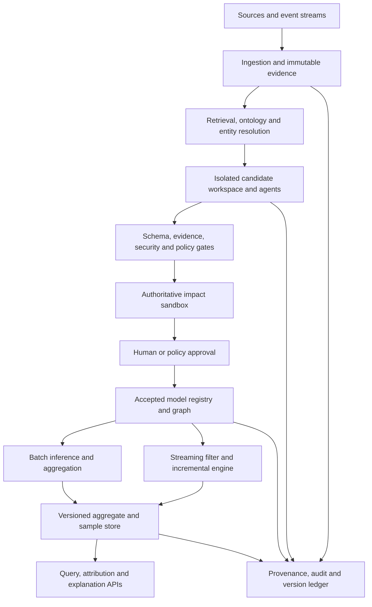
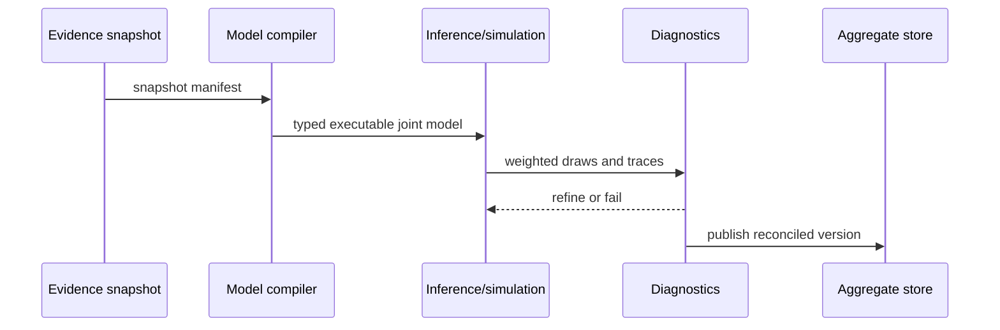
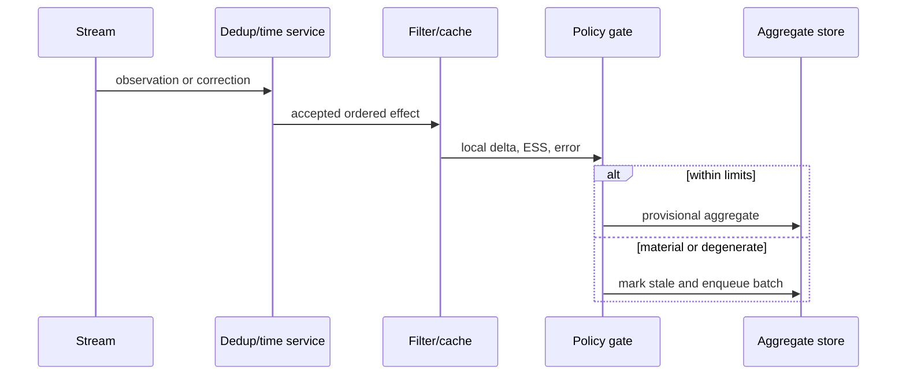
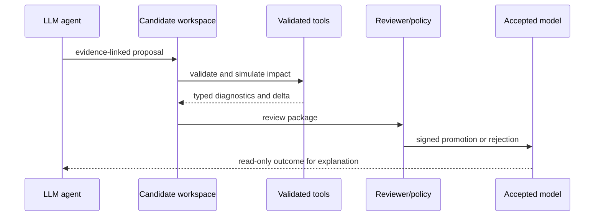
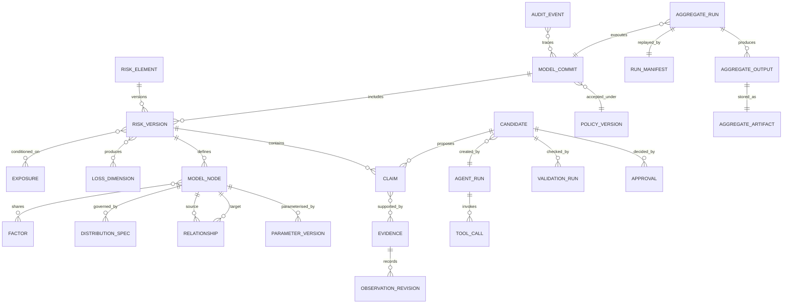
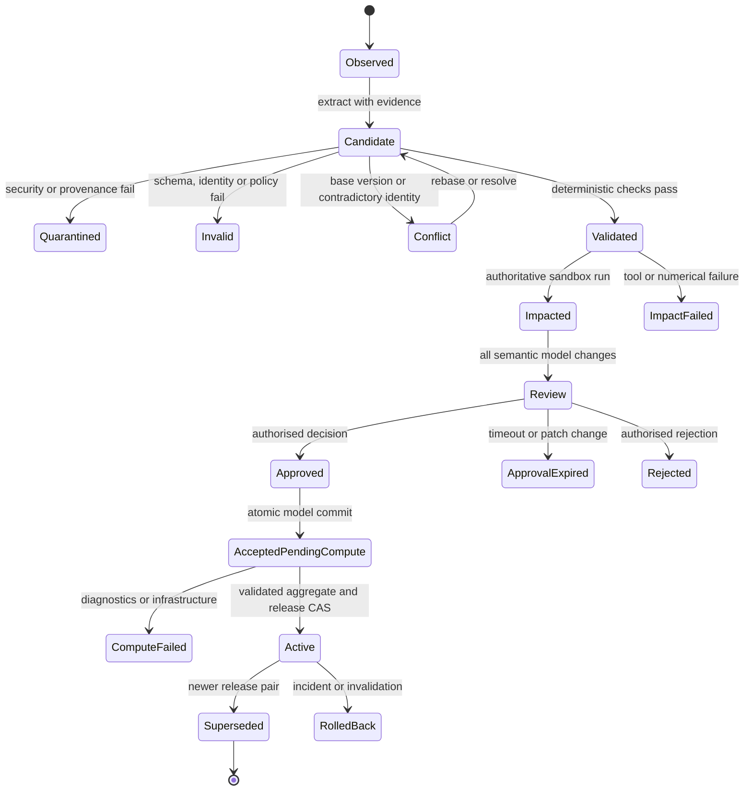

# Ground Risk: research conclusion and prototype specification

- **Research cut-off:** 5 August 2026
- **Scope:** domain-agnostic, dynamic aggregation of probability and loss distributions, with governed AI assistance
- **Decision status:** recommended reference model; implementation hypotheses are identified explicitly

## How to read the evidence

The report labels the basis of material claims: **T** = theorem, formal result, or conceptual analysis; **E** = empirical study; **S** = simulation or computational experiment; **STD** = standard or authoritative guidance; **D** = reasoned design inference from cited evidence. A second, independent source-status axis in section 19 distinguishes **PR** peer-reviewed main journal/conference, **PR-F** peer-reviewed Findings/workshop, **SR** systematic/review/textbook, **PRE** preprint, **STD**, **DEMO** demonstration/benchmark without peer-reviewed production evidence, **VENDOR**, and **DESIGN**. A design inference is not presented as a tested scientific finding. “AI” below includes language-model agents only where stated; it does not turn an LLM's text into probabilistic evidence.

## 1. Executive conclusion

No single reviewed theory meets all of Ground Risk's requirements. The defensible choice is a **modular generative probabilistic system** whose common mathematical contract is a versioned joint model, not a collection of risk scores:

1. A **dynamic hierarchical Bayesian causal factor graph** represents risk occurrences, conditional losses, exposures, controls, common causes, and time-varying state. Directed causal claims and merely statistical dependence have different edge types and acceptance tests.
2. **Tail and residual-dependence modules**—extreme-value models, copulas or vines, and latent factors—are attached only where their assumptions are supported. A copula supplies dependence, not causation.
3. **Process and cascade modules**—marked point/Hawkes processes, reliability submodels, stochastic Petri nets, network contagion, discrete-event or agent-based simulation—implement domain mechanisms and compile to the same generative interface.
4. An authoritative engine uses exact inference where tractable and otherwise posterior Monte Carlo, sequential Monte Carlo, and rare-event importance sampling or splitting. It produces posterior predictive **scalar or vector loss distributions** with aleatory variability separated from parameter/model uncertainty.
5. Expected loss, quantiles, value-at-risk (VaR), expected shortfall (ES), contribution measures, and stress results are derived views. They never replace the full distribution. Unlike harms remain a loss vector unless an approved, documented value/utility function makes scalarisation legitimate.
6. A batch engine produces reconciled, authoritative snapshots. A streaming engine updates affected subgraphs and cached particles provisionally, records approximation error and effective sample size, and triggers batch recomputation when structural or material changes exceed policy.
7. LLM agents retrieve, extract, map, compare, propose, explain, and orchestrate approved tools. They do **not** authoritatively estimate probabilities, infer causality, calculate aggregate risk in prose, approve their own evidence, or write directly to accepted model state. Candidate and accepted state are physically and logically isolated.

This recommendation follows from the complementary roles of the methods, not a claim that Bayesian networks alone solve aggregation. Bayesian graphical models expose conditional structure and permit updating; simulation composes heterogeneous loss mechanisms; extreme-value and dependence models protect tail semantics; mechanism-specific simulators cover feedback and cascades; imprecise or robust representations avoid false precision under severe ignorance. Exact Bayesian-network inference is NP-hard in general, and even approximation has worst-case hardness, so bounded approximation and measured reconciliation are architectural requirements rather than implementation details ([Cooper 1990](https://doi.org/10.1016/0004-3702(90)90060-D), T; [Dagum & Luby 1993](https://doi.org/10.1016/0004-3702(93)90036-B), T).

The full-distribution and dependence thresholds eliminate independent scorecards, simple convolution, and standalone risk measures. Among threshold-capable designs, the recommended hybrid is Pareto-preferred on auditability, sparse-data treatment, dynamic updating, and controlled agent compatibility, although it is more complex than a single graphical model. Section 10 makes that judgement transparent and tests alternative weights.

The right autonomy default is **supervised agency for material model changes**, **bounded autonomy for reversible, low-impact maintenance**, and a **copilot for novel or weakly evidenced claims**. Current evidence shows that retrieval and tool use improve access to sources but do not eliminate unsupported claims, citation failures, prompt injection, or multi-step agent errors ([Lewis et al. 2020](https://proceedings.neurips.cc/paper/2020/hash/6b493230205f780e1bc26945df7481e5-Abstract.html), E; [Gao et al. 2023](https://doi.org/10.18653/v1/2023.emnlp-main.398), E; [Mialon et al. 2024](https://proceedings.iclr.cc/paper_files/paper/2024/hash/25ae35b5b1738d80f1f03a8713e405ec-Abstract-Conference.html), E; [Jia et al. 2025](https://doi.org/10.18653/v1/2025.acl-long.1435), E). Therefore deterministic validation, least-privilege tools, impact simulation, approval, provenance, replay, and rollback are parts of the safety case—not optional workflow polish.

## 2. Definitions, assumptions, and research questions

### 2.1 Operational definitions

| Term | Operational meaning in Ground Risk | Consequence for the model |
|---|---|---|
| Risk | Uncertain consequences for valued objectives. Kaplan and Garrick's scenario–likelihood–consequence triplet is useful, while ISO 31000 defines risk more generally as the effect of uncertainty on objectives ([Kaplan & Garrick 1981](https://doi.org/10.1111/j.1539-6924.1981.tb01350.x), T; [ISO 31000:2018](https://www.iso.org/standard/65694.html), STD). | Store possible events/processes, occurrence model, conditional consequence distribution, horizon, exposure and evidence; do not reduce the record to one ordinal rating. |
| Uncertainty | Incomplete certainty about states, parameters, models, observations, or outcomes. | Represent aleatory draws separately from epistemic/posterior or set-valued uncertainty; report both. |
| Hazard | A source or condition with potential to cause harm; it is not itself probability or risk. | A hazard can cause several events and may be shared; model it once and reference it. |
| Exposure | The assets, people, objectives, duration, or system state subject to a hazard. | Occurrence and loss kernels are conditional on time-indexed exposure. |
| Probability | A coherent measure on specified events under a stated model and conditioning information. | Every probability needs an event definition, horizon, population/context, model version, and evidence basis. |
| Consequence / loss | An outcome conditional on an event and context; “loss” is its representation on one or more valued dimensions. | Preserve the conditional distribution and units. A negative consequence is not automatically monetised. |
| Marginal, conditional, joint | A marginal describes one variable; a conditional describes it given stated variables; the joint determines their co-occurrence and is needed for aggregate loss. | Marginals alone do not identify portfolio risk. Dependence must be modelled or explicitly bounded. |
| Statistical dependence | The joint distribution does not factor into the product of marginals. | Encode with factors, copulas, latent variables, undirected/statistical edges, or simulator coupling. |
| Causal dependence | An intervention on a cause would change the distribution of its effect under explicit causal assumptions. Observational association alone does not establish this ([Pearl 1995](https://doi.org/10.1093/biomet/82.4.669), T). | Causal edges require mechanism, temporal ordering, confounder analysis, evidence and a separate validation status. |
| Static / time-varying risk | Static models hold the relevant joint law fixed over the horizon; time-varying models let state, exposure, parameters or dependencies evolve. | Every model declares clock, event versus processing time, transition law and stationarity/regime assumptions. |
| Cascade / feedback | A cascade is propagation through successive conditional transitions; feedback means later system state changes a future cause/intensity/control, not merely a long acyclic chain. | Use time-indexed causal/process modules; do not put an unexplained directed cycle in one BN slice or infer likelihood from a scenario narrative. |
| Aggregate risk | The posterior predictive joint distribution of system loss over a defined horizon, optionally accompanied by an uncertainty set or model ensemble. | Scores, heat maps, expected loss and VaR are summaries, not the aggregate itself. |
| Probabilistic inference | Calculation or estimation defined by an accepted statistical model. | Performed by versioned numerical services with diagnostics. |
| Agentic inference | An agent's evidence-based extraction, hypothesis formation, tool selection, and workflow decision. | Produces candidate claims/actions; it is not a probability calculation and has no direct commit authority. |
| Candidate / accepted state | Candidate state contains new, generated or changed claims awaiting controls; accepted state contains only authorised, versioned model objects. | Separate stores, credentials, APIs and event topics; promotion is a governed transaction. |

These definitions reconcile rather than conflate traditions. The Society for Risk Analysis glossary explicitly recognises multiple legitimate risk conceptions, so the schema records the chosen operational semantics rather than pretending that one sentence resolves all disciplines ([SRA 2018](https://www.sra.org/wp-content/uploads/2020/04/SRA-Glossary-FINAL.pdf), STD).

### 2.2 Generative definition

For horizon \(H\), primitive event/process variables \(Z\), context and exposure \(X\), parameters \(\theta\), and model structure \(M\), define a loss vector

\[
\mathbf L_H = g_H(Z_{0:H},X_{0:H},\theta,M,\varepsilon),
\qquad
p(\mathbf L_H\mid D)=\sum_M\int p(\mathbf L_H\mid\theta,M,D)p(\theta,M\mid D)\,d\theta.
\]

The integral/sum may be evaluated by exact inference, quadrature, simulation, or a robust envelope. \(\varepsilon\) denotes outcome variability conditional on model and parameters; \((\theta,M)\) carry epistemic uncertainty. The system retains nested samples or sufficient summaries so it can report, for example, variability of loss conditional on a posterior draw and uncertainty about a tail quantile. Collapsing these layers into a single fitted point hides what more data could reduce ([Helton et al. 2006](https://doi.org/10.1016/j.ress.2005.11.017), E/methodological review).

If losses share a commensurable unit, time basis, and valuation rule, \(L=\sum_i L_i\) can be meaningful. If they do not, the authoritative output is \(\mathbf L=(L^{\text{safety}},L^{\text{service}},L^{\text{financial}},\ldots)\). Multi-attribute utility can provide a governed scalar decision view, but its preferential-independence and stakeholder-value assumptions must be elicited and tested ([Keeney & Raiffa 1993](https://books.google.com/books?id=GPE6ZAqGrnoC), T). Set-valued/vector risk measures can preserve orders without falsely adding dimensions ([Hamel & Heyde 2010](https://doi.org/10.1137/080743494), T).

| Loss representation | Valid use | Benefit | Limitation / governance condition |
|---|---|---|---|
| Scalar additive loss | Same unit, horizon, exposure boundary and valuation basis; interactions already included in \(G\) | Simple distribution, tail query and optimisation | Invalid for unlike harms; exchange-rate/discount/conversion models add uncertainty |
| Vector-valued loss | Unlike safety, service, environmental, rights or financial dimensions | Preserves joint trade-offs, dependence and Pareto dominance | Partial ordering can leave alternatives incomparable; dashboards must not silently rank them |
| Multi-attribute value/utility | A decision authority has elicited and validated value/utility, scaling and independence assumptions | Supports an explicit choice under trade-offs | Encodes stakeholder values and risk attitude; keep the original vector and version the function |
| Set-valued risk/constraint view | Decisions use acceptable sets, component limits or robust orders | Avoids forced scalarisation and can express model ambiguity | More difficult computation/communication; acceptance set is a governed value judgement |

### 2.3 Aggregation, summaries, and double counting

Convolution aggregates independent commensurable losses; with dependence the aggregate follows the joint law, not the marginal laws alone. Linear correlation is particularly inadequate for asymmetric or tail-dependent portfolios ([Embrechts, McNeil & Straumann 2002](https://people.math.ethz.ch/~embrecht/ftp/pitfalls.pdf), T). VaR is a quantile and can fail subadditivity; coherent risk measures satisfy monotonicity, subadditivity, positive homogeneity and translation invariance ([Artzner et al. 1999](https://doi.org/10.1111/1467-9965.00068), T). ES is a coherent tail-average under standard definitions, but neither ES nor any scalar risk functional reconstructs the underlying distribution ([Rockafellar & Uryasev 2000](https://doi.org/10.21314/JOR.2000.038), T).

Ground Risk prevents double counting with five invariants:

1. A primitive occurrence has one stable `event_definition_id`; taxonomy nodes, risk-register views and consequences reference it rather than re-create it.
2. Shared causes are explicit latent or causal nodes. Correlated downstream losses are jointly simulated conditional on the common cause, not added as if the cause were another independent loss.
3. Mutually exclusive scenario branches form a declared partition; overlapping scenarios carry inclusion/exclusion or joint-event semantics.
4. Evidence is immutable and content-addressed. Many claims may cite one observation, but it contributes likelihood once per declared observation model.
5. Entity resolution and overlap detection create candidate merge/conflict records. An LLM's similarity judgement never silently deletes or merges accepted risks.

### 2.4 Missingness is a model property

An absent observation is not a zero. Each observed field carries `observed`, `not_collected`, `below_detection`, `censored`, `not_applicable`, or `unknown` status plus its observation process. Missing completely at random, at random, and not at random imply different valid analyses; likelihood, imputation, bounds, or sensitivity analysis must match the mechanism ([Rubin 1976](https://doi.org/10.1093/biomet/63.3.581), T). Severe ignorance should widen posterior/model uncertainty or produce probability bounds, not a silent default.

### 2.5 Research questions and decision constraints

The primary question is which coherent combination represents the joint distribution, tails, time, common causes and cascades while remaining computable, explainable and updateable. The secondary question is which AI roles yield measurable net benefit after their errors propagate through the loss distribution. The decision has two hard thresholds:

- **T1 distribution:** produces or converges to a full scalar/vector aggregate distribution, not merely a score or one risk measure.
- **T2 dependence:** explicitly supports material nonlinear/tail dependence, common causes and at least an interface for causal, temporal and cascade mechanisms.

Auditability, scaling, incremental operation, missing-data robustness, and safe AI compatibility are dominant differentiators after those thresholds. Domain neutrality means stable mathematics and contracts, not a claim that one ontology, prior, causal graph, value function, or cascade kernel transfers unchanged between domains.

## 3. Research method and evidence assessment

### 3.1 Search protocol

The structured search ran through 5 August 2026 across Crossref/DOI metadata, publisher and society sites, ACM/IEEE/INFORMS/Project Euclid, ACL Anthology, NeurIPS/ICLR proceedings, arXiv for emerging work, NIST/W3C/ISO/IEC, and official research repositories. Representative query families combined:

- `compound loss convolution Panjer`, `copula vine tail dependence`, `extreme value aggregate risk`, `coherent expected shortfall`;
- `Bayesian network inference complexity`, `dynamic Bayesian network risk`, `causal graphical model intervention`, `probabilistic programming simulation`;
- `fault tree event tree stochastic Petri net`, `Hawkes process cascade`, `network contagion systemic risk`, `rare event splitting importance sampling`;
- `event time out of order exactly once replay streaming`, `incremental probabilistic inference`, `counter based random number generator`;
- `LLM extraction NER ontology mapping`, `RAG citation correctness`, `tool agent benchmark`, `agent prompt injection`, `automation bias`, and `AI risk management framework`.

Searches deliberately crossed probability/statistics, actuarial and finance, safety/reliability, operations research, network science, simulation, data systems, NLP, human–AI interaction and security. Backward chaining from seminal works and forward searches for critiques/replications supplemented keyword search.

### 3.2 Inclusion, exclusion, and evidence grading

Included material had at least one of: a formal result that bears directly on representation or computation; peer-reviewed empirical or simulation evidence; a recognised textbook; an official standard; or, for very recent agent security, a public benchmark with inspectable method. Primary sources were preferred over summaries. Domain case studies were included only as demonstrations of a method, not proof of universal transfer.

Excluded material included vendor assertions without reproducible evaluation, ordinal risk matrices as aggregate distributions, unsourced probability recommendations, papers that use “Bayesian/agentic” only rhetorically, and AI benchmarks with no inspectable task or metric. Preprints are labelled and never carry a production-safety conclusion alone. The report does not claim to have identified literature published after the cut-off, and “through August 2026” means available through 5 August, not the whole future month.

Evidence strength is evaluated along four axes: source status (formal/peer-reviewed/standard/preprint), design validity, external validity across domains, and directness to the proposed use. Formal coherence is not empirical calibration; a benchmark result on one model/task is not a stable capability guarantee; and a safety framework is guidance, not evidence that controls work in this implementation.

### 3.3 Evidence gaps

There is no controlled, cross-domain study of an LLM maintaining a live joint risk model and measuring downstream distribution error. Few agent benchmarks test irreversible state changes with probabilistic impact gates. Dynamic cascade models remain mechanism- and domain-specific; causal identifiability depends on intervention or untestable assumptions; tail estimation is data-hungry; and the operational cost/accuracy frontier of incremental posterior predictive aggregation is workload-specific. Consequently, the architecture and its autonomy policy are **D** design recommendations to be tested by the benchmark plan in section 15, not claims of already-demonstrated universal performance.

## 4. Taxonomy of risk-modelling theories

The approaches below occupy different layers. “Supports” means the method can supply that function under its assumptions; it does not mean a standalone implementation meets both thresholds.

| Family | Representation / dependence | Time, cause, cascade | Computation / estimation | Proper role and principal limitation | Evidence |
|---|---|---|---|---|---|
| Convolution and compound-loss models | Frequency–severity and sums; independence or specified mixing | Basic counting processes; no causal semantics by itself | Analytic transforms, recursion, FFT, Monte Carlo | Efficient baseline for many homogeneous losses. Panjer recursion covers a class of counting laws but dependence and mechanisms must be supplied externally. | [Panjer 1981](https://doi.org/10.1017/S0515036100006796), T |
| Monte Carlo and rare-event simulation | Any executable joint generative model | Whatever the simulator encodes | Sampling; importance sampling; splitting; uncertainty estimates | Universal composition engine asymptotically, not a model. Naive sampling is inefficient in rare tails; biased estimators or poor proposals can mislead. | [Metropolis & Ulam 1949](https://doi.org/10.1080/01621459.1949.10483310), T/S; [L'Ecuyer et al. 2006](https://doi.org/10.5555/1218112.1218142), S/review |
| Multivariate distributions, copulas and vines | Separates marginals from dependence; vines assemble pair copulas; can encode asymmetric/tail dependence | Usually static/statistical; covariates can make parameters dynamic but do not confer causality | Likelihood/Bayesian estimation and simulation | Valuable residual/tail layer. High-dimensional selection and sparse tail identification are fragile; correlation is not a copula and a copula is not a causal graph. | [Bedford & Cooke 2002](https://doi.org/10.1214/aos/1031689016), T; [Embrechts et al. 2002](https://people.math.ethz.ch/~embrecht/ftp/pitfalls.pdf), T |
| Latent-factor and hierarchical models | Conditional independence given common factors; multilevel parameter sharing | Factors can evolve in state-space form | Bayesian/frequentist inference, partial pooling | Natural common-cause and sparse-group layer. Factor interpretation and loading identifiability require constraints; omitted factors leave residual dependence. | [Gelman et al. 2013](https://www.stat.columbia.edu/~gelman/book/), textbook/T |
| Bayesian networks and probabilistic graphical models | Factorised joint distribution with explicit conditional dependencies | DAGs can encode causal assumptions; dynamic BNs unroll time | Exact message passing or approximate inference; posterior updating | Auditable semantic backbone. Cycles require temporal unrolling/structural equations; exact general inference is NP-hard and graph correctness dominates results. | [Heckerman 1995](https://www.microsoft.com/en-us/research/wp-content/uploads/2016/02/tr-95-06.pdf), T/tutorial; [Murphy 2002](https://www2.eecs.berkeley.edu/Pubs/TechRpts/2002/8174.html), T; [Cooper 1990](https://doi.org/10.1016/0004-3702(90)90060-D), T |
| Causal graphical / structural models | Interventional and counterfactual distributions under structural assumptions | Directed mechanisms; feedback through dynamic/structural models | Identification plus statistical estimation | Necessary to distinguish intervention from association. Causal direction is not learned reliably from prose plausibility; unmeasured confounding and transport remain hard. | [Pearl 1995](https://doi.org/10.1093/biomet/82.4.669), T |
| Fault trees, event trees and influence diagrams | Logical failure combinations, scenario branches, decisions/utilities | Event ordering and control logic; limited feedback unless extended | Boolean algebra, minimal cut sets, BN conversion, simulation | Excellent interpretable safety submodels. Independence assumptions at gates and duplicated basic events can understate common cause; trees scale poorly for dynamic loops. | [IEC 61025:2006](https://webstore.iec.ch/en/publication/4311), STD; [IEC 62502:2010](https://webstore.iec.ch/en/publication/7131), STD |
| Stochastic Petri nets | Places, transitions, resources and stochastic firing | Concurrency, state, repair, feedback and cascades | CTMC/state-space analysis or simulation | Strong discrete mechanism module; state explosion and parameter elicitation limit scale. | [Molloy 1982](https://doi.org/10.1109/TC.1982.1676110), T |
| Point, marked-point and Hawkes processes | Event intensities; marks represent type/severity; excitation represents clustering | Native continuous time and self-/cross-excitation | Point-process likelihood, Bayesian inference, simulation | Strong incident/contagion timing module. Excitation can reflect common shocks or observation artefacts and is not automatically causal; stationarity/branching constraints matter. | [Hawkes 1971a](https://doi.org/10.1093/biomet/58.1.83), T; [Hawkes 1971b](https://doi.org/10.1111/j.2517-6161.1971.tb01530.x), T |
| Network, cascade and systemic-risk models | Nodes/edges, exposures and threshold/clearing rules | Contagion, load redistribution and multi-stage cascades | Fixed points, percolation/branching analysis, simulation | Essential when topology and propagation are physical/economic mechanisms. Results are highly sensitive to missing edges and behavioural rules; not one universal probability model. | [Watts 2002](https://doi.org/10.1073/pnas.082090499), T/S; [Motter & Lai 2002](https://doi.org/10.1103/PhysRevE.66.065102), S; [Eisenberg & Noe 2001](https://doi.org/10.1287/mnsc.47.2.236.9835), T |
| Extreme-value theory (EVT) | Tail limits for maxima or threshold exceedances; multivariate EVT for joint extremes | Covariates/time-varying parameters possible | GEV/GPD and tail-process estimation, extrapolation | Principled tail extrapolation under domain-of-attraction and threshold assumptions. Tail samples are scarce; threshold/model choice and nonstationarity dominate uncertainty. | [Balkema & de Haan 1974](https://doi.org/10.1214/aop/1176996548), T; [Pickands 1975](https://doi.org/10.1214/aos/1176343003), T; [Embrechts, Resnick & Samorodnitsky 1999](https://doi.org/10.1080/10920277.1999.10595797), T/review |
| Agent-based, system-dynamics and discrete-event simulation | Executable actors, stocks/flows, queues and event rules | Rich adaptation, feedback and cascades | Simulation, calibration, emulation/surrogates | Mechanism-rich scenario engine when simpler factorisations fail. Identifiability, validation, computational cost and stochastic reproducibility are central weaknesses; deterministic system dynamics is not a probability model, and generated scenarios are not likelihood estimates. | [Banks et al. 2010](https://books.google.com/books?id=cW9Jq2VQW1oC), textbook; [Bonabeau 2002](https://doi.org/10.1073/pnas.082080899), D/review; [Sterman 2001](https://doi.org/10.2307/41166098), D/review |
| Imprecise probability and robust Bayes | Sets of probabilities/priors, lower/upper expectations | Can wrap static or dynamic models | Optimisation over a credal/model set | Honest envelope under deep ignorance or prior/model ambiguity. Bounds may be wide and computation difficult; it does not replace collecting evidence. | [Walley 1991](https://books.google.com/books?id=4FYZAQAAIAAJ), T |
| Dempster–Shafer evidence theory | Belief/plausibility masses over sets | Evidence combination rather than causal dynamics | Combination rules | Expresses unresolved alternatives, but conflict normalisation and independence of evidence sources need justification; recursive AI-derived evidence is especially unsafe. | [Dempster 1967](https://doi.org/10.1214/aoms/1177698950), T; [Shafer 1976](https://doi.org/10.1515/9780691214696), T |
| Possibility and fuzzy methods | Possibility/necessity or graded membership | Rule-based dynamics possible | Fuzzy aggregation and optimisation | Useful for vague linguistic categories, not a substitute for event probability. Calibration to frequencies and combination semantics are often unclear. | [Zadeh 1965](https://doi.org/10.1016/S0019-9958(65)90241-X), T; [Zadeh 1978](https://doi.org/10.1016/0165-0114(78)90029-5), T |
| Coherent, convex and distortion risk measures | Functionals of a loss distribution; vector/set-valued extensions | No generative time/cause model | Post-aggregation summarisation and optimisation | Decision/reporting layer. It cannot recover a distribution or fix dependence misspecification; scalarisation embeds preferences. | [Artzner et al. 1999](https://doi.org/10.1111/1467-9965.00068), T; [Föllmer & Schied 2002](https://doi.org/10.1007/s007800200072), T; [Wang 1996](https://doi.org/10.2143/AST.26.1.563234), T; [Hamel & Heyde 2010](https://doi.org/10.1137/080743494), T |
| Probabilistic programming (PPL) | Executable generative programs and reusable distributions | State-space, causal and simulator models if encoded | HMC, variational inference, SMC and diagnostics | Implementation substrate that separates model from inference. It does not guarantee identifiability, calibration or tractability; engine diagnostics and version pinning are mandatory. | [Carpenter et al. 2017](https://doi.org/10.18637/jss.v076.i01), E/software |

### 4.1 Layer classification

| Approach | Risk representation | Dependence | Temporal / causal | Aggregation | Estimation / inference | Simulation | Summary |
|---|:---:|:---:|:---:|:---:|:---:|:---:|:---:|
| Compound loss | ✓ | limited | limited | ✓ | ✓ | ✓ | — |
| Copula/vine/factor | — | ✓ | covariate only | via joint law | ✓ | ✓ | — |
| Hierarchical BN/DBN/causal PGM | ✓ | ✓ | ✓ | ✓ | ✓ | ✓ | attribution |
| Fault/event tree/Petri net | ✓ | common-cause extensions | ✓ | ✓ | parameter input | ✓ | cut sets |
| Point process/Hawkes | event representation | excitation | ✓ | via marks/sum | ✓ | ✓ | — |
| Network/ABM/DES/system dynamics | mechanism representation | ✓ | ✓ | ✓ | calibration often external | ✓ | — |
| EVT | tail representation | multivariate EVT | covariates | tail contribution | ✓ | ✓ | tail metrics |
| Imprecise/evidence/possibility/fuzzy | ignorance/vagueness | sets/rules | extensions | bounds/sets | robust/update rules | possible | bounds |
| Coherent/convex/distortion measures | — | consumes joint law | — | — | — | — | ✓ |
| PPL | hosts all above | hosts | hosts | computes | ✓ | ✓ | diagnostics |

The architecture therefore treats these as composable contracts. A cascade simulator may emit a conditional loss kernel consumed by the graphical model; a copula may join residuals after common factors; EVT may replace only a validated tail; ES is then computed from the final samples. Substituting ES for EVT, a knowledge graph for a causal graph, or an LLM scenario for a probability model is a category error.

## 5. Academic evaluation

### 5.1 Requirement-level assessment

The following matrix evaluates the method **on its own**, before integration. H means native/strong, M means possible with material assumptions or extensions, L means weak/not supplied, and “summary” means the method consumes rather than produces the distribution.

| Family | Full distribution | Nonlinear / tail dependence | Common cause | Cause / feedback / cascade | Time varying | Sparse / missing | Attribution | Main identifiability or calibration risk |
|---|:---:|:---:|:---:|:---:|:---:|:---:|:---:|---|
| Independent compound / convolution | H | L | L | L | M | M | H | Frequency/severity fit; independence is often untestable in tails. |
| Monte Carlo | H* | H* | H* | H* | H* | L* | M | Asterisk: only as good as the supplied generative model; finite-sample tail error. |
| Copula / vine | H | H | M | L | M | L–M | M | Family/structure selection, sparse joint extremes, changing marginals. |
| Latent-factor hierarchy | H | M–H | H | M | H | H | H | Rotation/loading/label identifiability and omitted factors. |
| BN / DBN / causal PGM | H | M | H | H, with assumptions | H | H | H | Markov equivalence, confounding, prior sensitivity, graph/treewidth. |
| Fault/event tree | M–H with explicit consequence/reward model | L–M | M | M | L–M | L–M | H | Classical forms give top-event/path probabilities; gate dependence/common cause, duplicated basic events and static logic remain risks. |
| Stochastic Petri net | H | H | H | H | H | L–M | M | Rates, state explosion and observational equivalence. |
| Point/Hawkes process | H | M | M | M | H | M | M | Background versus excitation, nonstationarity, observation thinning. |
| Network/systemic/cascade | H | H | H | H | H | L–M | M | Missing topology, behavioural/mechanism parameters, phase sensitivity. |
| EVT | Tail only | H | M | L | M | L | L–M | Threshold, tail index and stationarity with few exceedances. |
| ABM/system dynamics/DES | M–H with calibrated stochastic inputs | H | H | H | H | L–M | L–M | Deterministic system dynamics alone is not a probability distribution; equifinality, rule calibration, validation and stochastic noise remain risks. |
| Imprecise / robust probability | Set of distributions | H if base models do | H if base models do | M | M | H | Bounds | Choice of credal/model set; results can be vacuous. |
| Evidence / possibility / fuzzy | Belief/possibility, not necessarily probability | M | M | L–M | M | H for ignorance/vagueness | M | Combination semantics and calibration to frequencies. |
| Coherent/convex/distortion measures | Summary | Consumes tail | Consumes | L | L | L | Allocation possible | Choice of functional/preferences; no model identification. |
| PPL | H* | H* | H* | H* | H* | H* | M–H | Asterisk: host technology; posterior geometry, diagnostics and model validity. |

### 5.2 Assumptions and failure modes that survive integration

**Dependence.** Sklar-type copula construction is mathematically sound, but selecting a high-dimensional vine from limited observations can produce precise-looking tail results with little identifying evidence. Latent factors are preferable when there is an interpretable shared driver; residual copulas are then fitted conditionally to avoid counting the same common cause twice. Multivariate EVT is reserved for validated extreme regions, because ordinary correlation and central-distribution fit do not establish joint-tail behaviour ([Embrechts et al. 2002](https://people.math.ethz.ch/~embrecht/ftp/pitfalls.pdf), T; [Embrechts et al. 2009](https://doi.org/10.1007/s10687-008-0071-5), T).

**Causation.** A causal DAG is a set of assumptions, not a decorative knowledge graph. Some structures are observationally Markov equivalent; causal effects may be unidentified without interventions, instruments or justified restrictions. Dynamic feedback is represented by time-indexed edges or structural state transitions, never a directed cycle inside one acyclic time slice. Candidate edges retain `statistical`, `mechanistic`, `causal_assumed`, or `causal_identified` semantics and an evidence record ([Pearl 1995](https://doi.org/10.1093/biomet/82.4.669), T).

**Safety and decision formalisms.** Fault-tree analysis is deductive Boolean reasoning from component/basic events to a top event; event-tree analysis is forward conditional path reasoning from an initiator; neither supplies consequence distributions unless they are attached. Influence diagrams add decision and value nodes to a probabilistic graph and therefore belong at the decision-analysis layer ([Howard & Matheson 2005](https://doi.org/10.1287/deca.1050.0020), T). Stochastic Petri nets instead represent concurrent enabling, firing, repair and resource state; their advantage and state-explosion cost are materially different from tree logic. Treating these four as interchangeable “safety models” would hide their assumptions.

**Sparse evidence.** Hierarchical partial pooling can reduce variance but can also transfer bias across nonexchangeable groups. Priors must have prior-predictive checks; likelihood and missingness models require posterior-predictive checks and sensitivity to plausible alternatives. When evidence cannot distinguish models, model averaging, robust prior classes or lower/upper probabilities are more defensible than selecting one sharp number. Dempster–Shafer or possibility models can retain unresolved sets or linguistic vagueness, but their results must not be relabelled as calibrated probability.

**Tails.** EVT supplies asymptotically justified tail families, not unlimited extrapolation. Threshold stability, parameter uncertainty, dependence and nonstationarity diagnostics must accompany tail estimates. For an aggregate simulator, stratification, importance sampling or splitting targets rare loss regions, with likelihood ratios and estimator variance retained. Naive Monte Carlo should not support a tail claim when expected exceedances are near zero ([Balkema & de Haan 1974](https://doi.org/10.1214/aop/1176996548), T; [L'Ecuyer et al. 2006](https://doi.org/10.5555/1218112.1218142), S/review).

**Computation.** Graphical factorisation can make inference local, but complexity grows exponentially with treewidth; approximate inference does not remove worst-case hardness ([Cooper 1990](https://doi.org/10.1016/0004-3702(90)90060-D), T; [Dagum & Luby 1993](https://doi.org/10.1016/0004-3702(93)90036-B), T). Simulation adds ordinary sampling error, Markov-chain convergence error, rare-event error and software error. Every aggregate therefore identifies engine, method, diagnostics, numerical tolerances and approximation status.

**Attribution.** Conditional expectations, variance-based sensitivity, Shapley-style allocations, causal interventions and minimal cut sets answer different questions. “Which component co-varied with loss?”, “which input uncertainty drives output variance?”, “what is a fair allocation?”, and “what intervention changes loss?” must not share one generic contribution label. Correlated allocations can also obscure shared causes. Explanations state the estimand and group common-factor contributions separately.

### 5.3 Cross-domain validity

Bayesian networks, Monte Carlo, EVT, point processes, safety logic and network models have applications in multiple fields, but cross-domain use demonstrates portability of mathematics—not transportability of parameters or causal structure. Watts' cascade model and Eisenberg–Noe clearing model, for example, establish distinct mathematical mechanisms rather than one universal contagion law ([Watts 2002](https://doi.org/10.1073/pnas.082090499), T/S; [Eisenberg & Noe 2001](https://doi.org/10.1287/mnsc.47.2.236.9835), T). The proposed plug-in boundary preserves that distinction.

The hybrid is coherent if each module exposes a normalised conditional distribution or deterministic state transition with explicit randomness, units, horizon and parents; the composed graph/program defines one joint law; evidence contributions are not reused; and scalar summaries are applied only after composition. Modules that cannot meet this interface remain scenario-only analyses outside the authoritative probability model.

## 6. Information-system feasibility

### 6.1 Feasibility conclusion

Exact, globally synchronous recomputation after every event is infeasible for a large, changing probabilistic graph. A practical system can still be correct about its guarantees: immutable event-time ingestion; idempotent updates; affected-subgraph computation; provisional sequential/particle updates; cached conditional samples; and scheduled or materiality-triggered authoritative batch reconciliation. The Dataflow model demonstrates how event time, watermarks, triggers and accumulated state make out-of-order streams explicit, while MillWheel demonstrates persistent state and exactly-once processing patterns ([Akidau et al. 2015](https://doi.org/10.14778/2824032.2824076), E/systems; [Akidau et al. 2013](https://doi.org/10.14778/2536222.2536229), E/systems). These systems results support the processing model, not the correctness of a risk model.

### 6.2 Workload and complexity

Let \(V,E\) be graph nodes/edges, \(N\) posterior predictive samples, \(T\) time slices, \(P\) partitions, and \(K\) affected nodes. These are planning bounds, not performance promises.

| Operation | Indicative cost | Parallelisation / constraint |
|---|---|---|
| Schema, ontology and duplicate-key validation | \(O(1)\) indexed lookup to \(O(\log V)\); semantic candidate search approximately sublinear | Partition by tenant/domain and entity type; exact identity rules run after approximate retrieval. |
| DAG validation / affected reachability | \(O(V+E)\) worst case; usually \(O(K+E_K)\) | Maintain topological indexes and strongly connected components for allowed dynamic modules. |
| Exact BN inference | Exponential in treewidth, not merely \(V\) | Junction-tree components can run independently; reject unbounded real-time claims. |
| Discrete exact factor elimination | Approximately \(O(Vs^{w+1})\) time and \(O(s^{w+1})\) memory for representative state cardinality \(s\) and induced width \(w\) | Cardinality and elimination order matter as much as node count. |
| Independent convolution / FFT | Direct discrete convolution \(O(nm)\); FFT grids roughly \(O(G\log G)\) per merge | Grid truncation/aliasing and independence assumptions must be diagnosed. |
| Monte Carlo generative pass | Roughly \(O(N(TV+TE))\), plus mechanism engines | Samples and conditionally independent components partition naturally; aggregate with deterministic reductions. |
| SMC update | \(O(NK)\) plus likelihood and resampling | Partition particles; monitor effective sample size and weight degeneracy. |
| Rare-event splitting / importance sampling | Workload-dependent; often far below crude MC for a fixed tail error | Independent trajectories parallelise; retain weights, variance and proposal version. |
| Sample storage | \(O(Nd)\) for \(d\) retained outputs; full latent traces can be \(O(NTV)\) | Store columnar/chunked draws and summaries; retain reproducible seeds/manifests, not every transient state where regeneration is cheaper. |
| Quantile / tail query | Exact sort \(O(N\log N)\), selection \(O(N)\) expected; weighted tails require ordered cumulative weights | Materialised sketches may answer provisional queries only with a declared rank/error bound. |
| Lineage traversal | \(O(K+E_K)\) | Content-addressed provenance graph and indexes by aggregate/model/evidence version. |

Approximation choices are explicit:

- **Particle reweighting** is fast for new observations or moderate parameter changes but sacrifices accuracy when weights collapse; an ESS threshold forces resampling/rejuvenation or batch inference.
- **Local resimulation** is valid only across a declared conditional-independence boundary; structural changes, new shared causes and graph-wide factors trigger wider computation.
- **Surrogates/emulators** reduce expensive simulator latency but add model discrepancy. Their applicability domain, validation error and version are returned with results; out-of-domain queries fall back to the original engine.
- **Cached conditional distributions** are keyed by all material parents and model versions. Approximate keying or discretisation reports its error budget.
- **Streaming aggregates are provisional.** Batch reconciliation replaces them atomically and emits a signed delta explaining data lateness, approximation and model changes.

### 6.3 Event-time, consistency, and replay

Each observation carries source/event/ingest time, source sequence, idempotency key, content hash, correction/retraction link and privacy classification. Watermarks express a bounded completeness belief; they never mean later data is impossible. A late event updates the bitemporal evidence view, invalidates dependent caches, and creates a new aggregate version. Duplicate delivery is harmless because the observation identity and effect ledger are idempotent. Corrections compensate prior effects rather than mutate history.

An accepted-state commit is an optimistic transaction over the candidate base version: validate → simulate impact → authorise → compare-and-swap → publish an outbox event. Consumers record processed event IDs. **Candidate branch**, **accepted model commit**, and **active aggregate publication** are three distinct pointers: accepting M2 does not make a provisional or failed M2 calculation the active decision result. Batch jobs read a snapshot and publish only if their manifest still targets the intended accepted version; otherwise they are retained as historical runs or restarted.

Deterministic replay pins accepted evidence revision hashes and source offsets; model/ontology/parameter/schema/code/container/numerical-library/runtime/hardware/prompt/agent/tool/policy versions; sorted partitioning and a fixed reduction tree; inference settings; and random streams. A counter maps `(master_seed, outer_model_draw, sample_id, variable_id, time_index, draw_index)` to randomness so adding a partition does not change existing draws. Counter-based random number generators permit reproducible parallel substreams without mutable global state ([Salmon et al. 2011](https://doi.org/10.1145/2063384.2063405), E/computational). Replay levels are explicit: **bitwise** (same supported runtime/hardware), **numerical** (values within per-output tolerances), and **statistical** (distributional tests/intervals only). Hosted LLM outputs have replayable inputs/provenance, not a false bitwise guarantee.

### 6.4 Storage, observability, security, and privacy

Use separate logical stores optimised for immutable evidence/events, relational model metadata, graph topology, parameters/distributions, large sample objects, aggregates, and append-only audit. W3C PROV supplies interoperable entity–activity–agent provenance concepts but must be extended with probabilistic semantics and decision authority ([W3C PROV-O 2013](https://www.w3.org/TR/prov-o/), STD). Evidence objects key by tenant/source/logical-record/revision/content hash; graph storage maintains forward and reverse adjacency plus temporal/factor indexes; sample files partition by run/loss dimension/sample-ID range and contain outer-model draw, inner aleatory draw, weight and trace references; streaming checkpoints atomically bind state hashes, accepted source offsets and outbox/output IDs. Cache keys include component/model commit, accepted evidence cut, all material parent states, engine/code and approximation version. Graph partitioning is permitted only across validated probabilistic separators or explicit message interfaces—not arbitrary community cuts.

Operational metrics cover queue lag and watermark delay; validation/rejection rates; particle ESS and Monte Carlo error; sampler convergence/divergences; cache hit and invalidation; reconciliation delta; calibration drift; tail exceedance coverage; stale evidence; agent/tool error; approval latency; and security events. Access is least privilege by tenant, purpose, field and tool; sensitive text is minimised/redacted before model calls; retrieval honours source ACLs; secrets never enter prompts; encryption, retention and deletion policy apply to evidence and derived embeddings. Secure development and control selection should map to NIST SSDF and SP 800-53 rather than inventing an AI-only security perimeter ([NIST SP 800-218](https://doi.org/10.6028/NIST.SP.800-218), STD; [NIST SP 800-53r5](https://doi.org/10.6028/NIST.SP.800-53r5), STD).

## 7. Taxonomy of AI and agentic roles

| Role | Suitable outputs | Required authority boundary | Recommended mode |
|---|---|---|---|
| Conversational interface | Parsed query plan, retrieved model views, plain-language explanation with citations | Read-only by default; query compiler and result renderer are deterministic/authoritative | Bounded agent |
| Evidence triage and extraction | Candidate event/risk/cause/control fields and spans | Source text, offsets and hashes required; schema validator; no accepted write | Bounded for queueing, supervised for promotion |
| Ontology/entity mapping | Ranked candidate concepts, duplicates, contradictions | Exact constraints plus entity-resolution score; merge is reversible and reviewed when material | Bounded/copilot |
| Model-building assistant | Candidate nodes, distributions, priors, dependencies and missingness mechanism | Every number/link is a hypothesis; statistical/causal tool or authorised expert validates | Copilot |
| Continuous maintenance | Staleness, conflicts, drift signals, recalculation requests | Can open candidate changes/jobs; cannot bypass materiality or acceptance policy | Bounded agent |
| Scenario/cascade explorer | Structured scenario and candidate pathways | Scenario plausibility is not frequency; authoritative simulator calculates outcomes | Copilot/supervised |
| Tool/workflow orchestrator | Typed tool plan and calls, retries, review routing | Allow-listed tools, scoped credentials, argument validators, budgets and task-alignment check | Bounded or supervised |
| Explanation and review package | Source-linked change narrative, assumptions, diagnostics | Facts and numbers are retrieved from lineage/engines; faithfulness tests | Bounded agent |
| Probabilistic estimator | At most a candidate family/prior/range with rationale | Fitted parameters and posterior come from accepted data and statistical engine; approval as applicable | Copilot only |
| Autonomous decision-maker | Low-impact reversible housekeeping only | No autonomous material model/causal/value/policy decision | Generally prohibited |

Knowledge graphs organise entities and claims; they do not by themselves define a normalised joint distribution or causal intervention. Retrieval-augmented generation (RAG) gives a model inspectable external context, and tool-using patterns let it request specialised calculations ([Lewis et al. 2020](https://proceedings.neurips.cc/paper/2020/hash/6b493230205f780e1bc26945df7481e5-Abstract.html), E; [Yao et al. 2023](https://openreview.net/forum?id=WE_vluYUL-X), E). The safe composition is therefore **LLM proposes a typed operation → deterministic policy validates it → an authoritative service executes it → the LLM explains returned facts**, never free-form calculation masquerading as an engine result.

## 8. Evidence for and against each AI role

### 8.1 Evidence synthesis

| Activity | Evidence of value | Evidence against over-reliance | Production conclusion and metrics |
|---|---|---|---|
| Candidate extraction / NER | Generative relation extraction and schema-constrained information extraction demonstrate that models can produce candidate entities and relations in evaluated ontologies ([Huguet Cabot & Navigli 2021](https://doi.org/10.18653/v1/2021.findings-emnlp.204), E; [Josifoski et al. 2022](https://doi.org/10.18653/v1/2022.naacl-main.342), E). Zero-shot NER studies add evidence of schema generalisation ([Xie et al. 2023](https://doi.org/10.18653/v1/2023.emnlp-main.493), E). | Accuracy varies by entity, domain and prompt; a constrained identifier is not a true claim, and benchmark labels are simpler than nested, contradictory risk claims. | Use as recall-oriented candidate generator. Measure span/entity micro and macro precision/recall/F1, relation F1, missingness-state accuracy, latency and reviewer time. |
| Retrieval and evidence attachment | RAG improved knowledge-intensive generation in the original evaluated tasks and makes sources available for inspection ([Lewis et al. 2020](https://proceedings.neurips.cc/paper/2020/hash/6b493230205f780e1bc26945df7481e5-Abstract.html), E). | RAG does not guarantee claim support. ALCE found substantial citation completeness/correctness gaps, while RAGTruth provides about 18,000 manually annotated responses showing hallucination persists in RAG settings ([Gao et al. 2023](https://doi.org/10.18653/v1/2023.emnlp-main.398), E; [Niu et al. 2024](https://doi.org/10.18653/v1/2024.acl-long.585), E). | Require claim-level source spans and entailment/human checks. Measure retrieval recall@k, citation precision/recall, source authority, unsupported-claim rate and ACL leakage. |
| Ontology mapping / entity resolution | OLaLa combined candidate generation, prompting and filtering and achieved competitive results on its ontology-alignment benchmarks ([Hertling & Paulheim 2023](https://doi.org/10.1145/3587259.3627571), E). Pretrained-language entity matching has also been evaluated empirically ([Li et al. 2021](https://doi.org/10.14778/3421424.3421431), E). | Similar language does not establish event identity; pairwise results may violate cluster consistency, and false merges can erase tail scenarios or cause double counting. | Retrieve candidates, then apply formal ontology/unit/temporal constraints, cluster checks and review. Measure top-k mapping accuracy, pair and cluster metrics, false-merge cost and downstream distribution delta. |
| Dependency / causal proposal | Models can surface overlooked hypotheses and translate text into graph candidates (**D**). CLadder found causal reasoning challenging, and a 2025 study found reliability limitations for novel/rare causal discovery and sensitivity to contextual misinformation ([Jin et al. 2023](https://doi.org/10.52202/075280-1353), E; [Feng et al. 2025](https://doi.org/10.18653/v1/2025.acl-long.471), E). | Text co-occurrence and fluent explanation do not identify causal effects; memorised relations can appear to be reasoning and sources may repeat one unsupported root claim. | Hypothesis only. Require temporal/mechanistic evidence, causal identification review and impact gate. Measure signed-edge/type accuracy, calibration, acceptance/correction and causal-effect validation. |
| Distribution / prior suggestion | Can retrieve analogous models and encode expert rationale into a candidate schema (**D**). | A direct product-risk study found weak/inconsistent quantitative likelihood and severity assessment, and LLM verbal confidence is task-dependent and overconfident ([Collier, Gruss & Abrahams 2025](https://doi.org/10.1111/risa.14351), E; [Xiong et al. 2024](https://proceedings.iclr.cc/paper_files/paper/2024/hash/6733cf15e10e2cd1d59af033c3bb8507-Abstract-Conference.html), E). Fabricated or inaccurate references are documented for particular model versions and systematic-review prompts ([Chelli et al. 2024](https://doi.org/10.2196/53164), E). | Agent never emits an accepted numeric parameter. Statistical fitting, elicitation protocol, prior-predictive checks and approval are authoritative. Measure candidate utility, rejection reason and posterior predictive impact—not prose confidence alone. |
| Scenario and cascade discovery | Multi-step reasoning plus tools can generate and test structured paths; ReAct demonstrated benefits of interleaving reasoning and actions on evaluated tasks ([Yao et al. 2023](https://openreview.net/forum?id=WE_vluYUL-X), E). Risk and safety case studies report ideation assistance but also generic, implausible or inconsistent outputs ([Collier et al. 2025](https://doi.org/10.1111/risa.14351), E; [Charalampidou, Zeleskidis & Dokas 2024](https://doi.org/10.1016/j.ssci.2024.106608), E). | Agent benchmarks expose a large gap on complex real-world questions; generated combinations lack probability semantics. GAIA's original evaluation reported a very large human–model performance gap on its tasks ([Mialon et al. 2024](https://proceedings.iclr.cc/paper_files/paper/2024/hash/25ae35b5b1738d80f1f03a8713e405ec-Abstract-Conference.html), E). | Use for search coverage, not likelihood. Measure novel valid pathway recall, invalid-edge rate, simulator acceptance, expert utility and compute cost. |
| Query and explanation | Natural-language access can reduce query burden; grounded generation can cite lineage (**E/D**). | Chain-of-thought explanations can rationalise biased answers rather than faithfully report the basis of an output, while automation bias is documented across decision-support studies ([Turpin et al. 2023](https://doi.org/10.52202/075280-3275), E; [Goddard, Roudsari & Wyatt 2012](https://doi.org/10.1136/amiajnl-2011-000089), systematic review/E). | Explanations are templates over engine outputs plus source-linked narrative; display uncertainty/conflicts. Test numeric exactness, citation entailment, counterfactual faithfulness, user comprehension and over-reliance. |
| Workflow/tool orchestration | Tool use expands the actions models can perform; Toolformer and ReAct establish feasibility of learned/explicit tool invocation ([Schick et al. 2023](https://proceedings.neurips.cc/paper_files/paper/2023/hash/d842425e4bf79ba039352da0f658a906-Abstract-Conference.html), E; [Yao et al. 2023](https://openreview.net/forum?id=WE_vluYUL-X), E). | More agency expands attack and failure surface. AgentHarm and WASP show that contemporary agents can comply with harmful requests or be diverted by prompt injection on their tested benchmarks ([Andriushchenko et al. 2025](https://proceedings.iclr.cc/paper_files/paper/2025/hash/c493d23af93118975cdbc32cbe7323f5-Abstract-Conference.html), E; [Evtimov et al. 2025](https://proceedings.neurips.cc/paper_files/paper/2025/hash/1c9818387f5dd0a0bc151214660f059d-Abstract-Datasets_and_Benchmarks_Track.html), E). | Least-privilege typed tools, task/action alignment, dry-run and approval. Measure task success, unsafe action rate, policy bypass, tool argument error, retries, cost and deterministic replay. |
| Autonomous model maintenance | Low-impact tasks such as tagging stale candidates and scheduling an idempotent job are automatable (**D**). | There is no direct evidence supporting unconstrained autonomous maintenance of a high-stakes joint risk model; nondeterminism and compounding errors make self-approval unsafe. | Only reversible actions within explicit budgets. Material model changes are supervised; novel causal/value changes require human authority. |

### 8.2 Evaluation must include propagation to risk output

Conventional extraction F1 is necessary but insufficient. For each seeded AI error \(e\), rerun the accepted-model sandbox and estimate

\[
\Delta_e = d\!\left(P(\mathbf L_H\mid D,M),P(\mathbf L_H\mid D,M+e)\right),
\]

where \(d\) includes Wasserstein/energy distance for full samples, tail-quantile and ES change with intervals, probability-of-threshold change per loss dimension, and decision/policy flips. Report mean and worst credible propagation by error type. A rare false causal edge may matter more than hundreds of benign classification errors; aggregate impact therefore helps set review thresholds.

Human evaluation records acceptance, correction, rejection, later reversal, inter-reviewer agreement, review time and automation-bias controls. Repeated runs measure variance across prompt/model/tool versions. Domain-shift sets, incomplete/contradictory sources and adversarial documents are mandatory, not optional “hard examples.”

### 8.3 README activity coverage and evidence directness

This matrix prevents adjacent NLP evidence from being presented as direct risk-system validation. “PR-direct” means the studied task is substantially the named activity; “PR-adjacent” requires local transfer testing; “DESIGN” means no direct production evidence was found by the cut-off. Citations are the linked primary sources in section 8.1 and the status-labelled records in section 19.

| Required activity | Evidence and limitation | Boundary and decisive metric |
|---|---|---|
| Extract risks, events, causes, consequences, controls and indicators | PR-adjacent IE/relation extraction; risk/safety studies are small and task-specific. Truth and completeness are not guaranteed. | Bounded candidate only; type/span precision/recall, supported-claim rate, severe omission rate. |
| Map domain language to ontology; classify and associate assets/processes/objectives/exposures/controls | PR-direct ontology/entity matching plus PR-adjacent IE. Formal unit, time and ontology constraints are outside textual similarity. | Candidate ranking; top-k mapping, constraint violations, steward correction and impact-weighted error. |
| Detect duplicate, overlapping, nested or contradictory risks | PR-adjacent entity matching; binary pair benchmarks do not cover all risk relations or cluster consistency. | Candidate typed relation; pair and cluster metrics, false-merge cost, double-count impact and reversal. |
| Propose causal, conditional, common-factor or dependency relationships | PR-direct causal benchmarks are evidence **against** autonomous authority; they expose novelty/context sensitivity. | Copilot hypothesis; edge type/direction precision/recall, graph validity, identification review and aggregate impact. |
| Build candidate knowledge graphs | PR-direct/adjacent generative KG work supports extraction/canonicalisation, not probabilistic or causal validity. | Quarantined claim graph; edge support, provenance coverage, ontology consistency and reviewer yield. |
| Detect unmodelled risks or change in known risks | No direct cross-domain live-risk evidence; DESIGN inference from retrieval, change detection and ideation studies. Absence from retrieval is not absence. | Alert/candidate only; known-risk recall, novel valid yield, false alarms, time-to-detect and escaped impact. |
| Retrieve evidence; suggest distributions, priors, scenarios or ranges | PR-direct RAG supports retrieval; direct risk evidence cautions against free-form quantitative estimation. | Read/candidate only; evidence recall/citation support, expert utility, rejected-number rate; statistical fit remains authoritative. |
| Recognise sparse/missing data and missing versus zero | No direct evidence that an LLM reliably identifies the observation mechanism across domains; DESIGN. | Agent flags typed candidates; missingness confusion matrix. Deterministic data contracts/authorised owner decide and no imputation is silent. |
| Detect invalidated assumptions, stale/unsupported components, and monitor signals | No direct longitudinal accepted-model maintenance study; DESIGN from retrieval/classification. | Agent may open alerts/candidates; precision/recall against adjudicated changes, detection delay, stale-days, reviewer burden. |
| Initiate recalculation and preserve version history | PR-adjacent tool use supports calling functions, not state correctness. | Bounded idempotent trigger only; exact job/version selection, duplicate-call rate, policy failures and replay. Durable workflow owns history. |
| Generate scenarios/counterfactuals; find chains, feedback, cascades and overlooked combinations | PR-direct risk/safety ideation case studies plus PR-adjacent agent reasoning show useful breadth and inconsistent validity. No probability semantics. | Copilot; valid unique pathway recall/yield, constraint violations, duplicate rate and expert utility. Never attach LLM likelihood. |
| Translate scenarios to simulator inputs; call engines; compare outcomes/sensitivities | PR-adjacent structured extraction/tool benchmarks. Long-horizon/state failures remain. | Typed supervised workflow; argument exactness, simulator validation, task success, repeat consistency. Numerical comparison comes from engine. |
| Translate natural-language questions to model queries | PR-adjacent tool/query evidence; no direct Ground Risk evaluation. A syntactically valid query may have wrong horizon/unit/scope. | Read-only typed query; semantic execution accuracy, ACL violations, unit/horizon exactness and abstention. |
| Explain aggregate changes, attribution and sensitivity | PR evidence shows generated explanations can be unfaithful; no direct proof of faithful narrative over this model. | Render deterministic explanation payload; numeric/citation/lineage exactness, counterfactual faithfulness and comprehension. |
| Trace to source and generate review packages | PR-direct citation/RAG and human–AI evidence, plus STD provenance guidance; review quality remains context-specific. | Evidence-first package; citation completeness, seeded-error detection, appropriate reliance, review time and reversal. |
| Conversational exploration without unauthorised change | PR-adjacent querying; security benchmarks show prompt/tool attacks. | Read-only capability token; unauthorised-action rate, exfiltration, injected-task success and benign utility. |
| Select tools, coordinate stages, route uncertainty, monitor jobs and handle failures | PR-direct tool/agent benchmarks show feasibility and persistent long-horizon/security failures; policy routing itself is DESIGN. | Bounded/supervised orchestration; pass^k workflow success, valid/no-call accuracy, recovery/compensation, cost and human intervention. |
| Maintain audit of observations, reasoning summaries, calls, approvals and results | STD provenance/governance supports records; no evidence makes private chain-of-thought a reliable audit source. | Deterministic workflow ledger; field/hash completeness, replay, tamper tests and source-to-output trace. |

## 9. Risk, governance, and autonomy analysis

### 9.1 Operating models

| Mode | State-changing authority | Appropriate use | Not appropriate |
|---|---|---|---|
| Copilot | None | Novel risks, causes, distributions, priors, scenarios, policy/value judgements | Silent updates or recalculation presented as accepted |
| Bounded agent | Reversible low-impact candidate/operational actions after deterministic checks | Triage, classification, metadata completion, duplicate queue, stale-evidence alert, approved read queries, idempotent recompute trigger | Causal link acceptance, material parameter update, evidence deletion, scalarisation choice |
| Supervised agent | Executes a broader typed plan with approval checkpoints | Validated extraction promotion, parameter-fit workflow, structural changes, material recalculation and release | Self-approval or approval based only on its own explanation |
| Autonomous agent | Only explicitly enumerated actions within formal policy, budget and rollback | Low-risk housekeeping where worst-case effect is bounded and continuously evaluated | General authority over accepted risk model or decisions based on it |

### 9.2 Activity-level recommendation

| Activity | Default mode | Automatic only if… | Escalate when… |
|---|---|---|---|
| Discover/extract candidate | Bounded | Source/span/schema/ACL checks pass; remains candidate | Low evidence, sensitive source, contradiction, novel class |
| Map ontology / link entity | Bounded candidate | May auto-route/store a candidate after hard type/unit/context checks; accepted semantic mapping is supervised | Candidate ambiguity, possible merge, cross-tenant link |
| Merge/delete/resolve duplicate | Supervised | Never for material accepted primitives | Any accepted object or evidence effect changes |
| Propose dependency | Copilot | Never promoted solely by agent | Causal/common-cause/tail link, weak or circular evidence |
| Suggest distribution/prior | Copilot | Never numerically accepted solely by agent | Sparse tails, expert judgement, high sensitivity |
| Fit/update parameter | Supervised statistical tool | The fit job may run automatically on pre-approved model/data; accepting its parameter remains supervised | Diagnostics fail, OOD, large posterior/aggregate delta |
| Generate scenario | Copilot | May save labelled scenario, never probability | Presented as likely, duplicates accepted event, unsafe action |
| Run simulation/recompute | Bounded | Read-only/idempotent, quota and version manifest pass | Excess cost, structural change, engine diagnostic failure |
| Explain/query | Bounded | Read-only, lineage-grounded, numerical values copied from typed result | Unsupported claim, sensitive output, requested state change |
| Commit model state | Supervised | No semantic model class is automatic in the initial policy | Material, novel, irreversible, regulated, conflicted or OOD |
| Rollback | Policy service / human | Pre-authorised emergency rollback to known-good version | Ambiguous target or evidence/legal hold implications |

### 9.3 Materiality and escalation policy

A policy engine evaluates: distribution distance and tail/threshold deltas; evidence quality/independence; posterior and agent uncertainty; novelty; reversibility; regulatory significance; model/data/agent disagreement; missingness change; OOD/security signals; and cumulative changes within a rolling budget. No single language-model confidence score controls acceptance.

An illustrative decision rule is:

```text
DENY if schema, provenance, ACL, task-alignment, or engine-validity check fails
QUARANTINE if prompt injection, poisoning, circular provenance, or OOD is suspected
REQUIRE specialist approval if causal semantics, loss valuation, tail model,
  missing-not-at-random mechanism, or structural graph change is proposed
REQUIRE owner approval if any policy threshold for distribution impact is exceeded
AUTO-COMMIT only deterministic, non-semantic housekeeping on a closed initial allow-list
  (for example index refresh, format-preserving metadata normalisation, candidate expiry,
  or an idempotent compute trigger); an LLM judgement never determines materiality
```

Initially, **every semantic model change** requires supervised acceptance: primitive identity; merge/delete; ontology meaning; evidence admissibility/effect; probability, loss, prior or parameter; causal/dependence/common-factor edge; missingness/observation mechanism; aggregation membership; and valuation or policy. An LLM may create the candidate or trigger a read-only/idempotent calculation, but it cannot put any of these changes on an automatic path. Thresholds are domain policy computed by external services, validated against historical decisions and false-negative costs. NIST AI RMF and its Generative AI Profile support risk-based governance, documented measurement and lifecycle controls, but they do not certify this design ([NIST AI RMF 1.0](https://doi.org/10.6028/NIST.AI.100-1), STD; [NIST AI 600-1](https://doi.org/10.6028/NIST.AI.600-1), STD).

### 9.4 Threat model and mitigations

| Threat / failure | Control set | Residual risk / test |
|---|---|---|
| Hallucinated risk, evidence, parameter or causal link | Claim-level spans; source allow/deny policy; typed schemas; independent deterministic/statistical validation; candidate isolation | Plausible but unsupported claims survive weak review. Seed unsupported claims and measure promotion rate. |
| Automation bias / fluent explanation | Blind or counterbalanced review; show evidence and uncertainty before recommendation; require reviewer rationale; sample double review | Humans may rubber-stamp at scale. Measure correction by presentation condition and later reversal. |
| Direct/indirect prompt injection | Treat documents as data; instruction/data separation; task-action alignment; content scanning; least-privilege tools; no secrets; sandbox; approval | No prompt-only defence is complete. Task Shield reduced attack success on AgentDojo but retained imperfect utility, so it is one layer only ([Jia et al. 2025](https://doi.org/10.18653/v1/2025.acl-long.1435), E). |
| Poisoning / malicious knowledge | Corpus-admission approval; signed source manifests; immutable corpus/index versions; source trust/diversity and canonical-root checks; mirror/near-duplicate detection; anomaly/influence tests; retriever rollback; descendant quarantine; two-person approval for high-impact evidence | PoisonedRAG empirically demonstrated that a small set of malicious retrieval documents could steer answers in the studied systems, so retrieval grounding is not a trust guarantee ([Zou et al. 2025](https://www.usenix.org/conference/usenixsecurity25/presentation/zou-poisonedrag), E). Test targeted and slow poisoning plus trusted-source compromise. |
| Unauthorised state change / tool misuse | Separate credentials/stores; RBAC/ABAC; typed allow-listed tools; capability tokens; dry-run; transaction policy; audit/outbox | Confused-deputy and privilege chaining. Red-team cross-tool sequences. |
| Recursive AI evidence | `origin_type`, derivation DAG and canonical primary-root ID; AI summary/mirror/human-edited derivative adds zero independent roots; generated-output indexes excluded from primary evidence by default; cycle/syndication/near-duplicate collapse to one evidence effect | Origin markers can be stripped outside the system. Measure false-independence and duplicate-effect promotion under paraphrase/syndication attacks. |
| Confidential leakage | ACL-aware retrieval; minimisation/redaction; private execution; output DLP; tenant isolation; retention policy | Semantic inference and embedding leakage. Canary tests and access reviews. |
| Drift / nondeterminism | Frozen evaluation sets; shadow runs; prompt/model registry; repeated-run variance; canary release; rollback | Provider/model changes may be opaque. Fail closed for unversioned material workflows. |
| Missing versus absent evidence | Explicit observation-status enum and observation model; validator rejects numeric zero default | Upstream source semantics may be unknown. Require owner review and sensitivity bounds. |

OWASP's LLM risk catalogue usefully identifies prompt injection and excessive agency, while NIST's adversarial-ML taxonomy supplies a broader lifecycle vocabulary; both are guidance to operationalise and test, not proof of mitigation ([OWASP LLM01:2025](https://genai.owasp.org/llmrisk/llm01-prompt-injection/), industry guidance; [NIST AI 100-2e2025](https://doi.org/10.6028/NIST.AI.100-2e2025), STD).

The enforceable provenance rule is `independent_root_count(claim) = count(distinct admitted canonical_primary_root_id)`. An AI output, summary, mirror, syndication or human-edited derivative may help retrieval but cannot increment that count or contribute another likelihood effect. Any provenance cycle fails admission; uncertain root identity is represented as dependence/one conservative effect, not assumed independence.

## 10. Comparative matrices and sensitivity analysis

### 10.1 Scoring method

Anchors were defined before scoring:

- **0:** absent or contradicts the criterion;
- **1:** ad hoc external workaround, severe limitations, or no validation path;
- **2:** partial support with material restrictions;
- **3:** adequate native support plus a plausible validation/operating path;
- **4:** strong native support, explicit diagnostics and mature theory/evidence.

T1 full distribution and T2 required dependence are gates: a score below 3 fails. The comparison unit is a candidate architecture, not an isolated summary statistic. Scores are reasoned design assessments (**D**) based on sections 4–9, with uncertainty of roughly one anchor where workload/domain evidence is absent.

| Candidate | T1 distribution | T2 dependence/common cause/time/cascade | Academic coherence | Explain / audit | Scale | Incremental | Sparse / missing | Safe agent use | Build simplicity | Gate |
|---|:---:|:---:|:---:|:---:|:---:|:---:|:---:|:---:|:---:|---|
| A. Independent compound loss + Monte Carlo | 4 | 1 | 3 | 3 | 4 | 4 | 1 | 3 | 4 | **Fail T2** |
| B. Copula/vine portfolio + Monte Carlo | 4 | 2 | 4 | 2 | 2 | 2 | 1 | 2 | 3 | **Fail T2**: no causal/cascade foundation |
| C. Dynamic hierarchical BN + Bayesian simulation | 4 | 3 | 4 | 4 | 2 | 3 | 4 | 4 | 3 | Pass |
| D. Mechanism-first network/ABM/DES ensemble | 4 | 4 | 3 | 2 | 2 | 2 | 2 | 2 | 2 | Pass |
| E. Proposed PGM + tail + mechanism + robust simulation hybrid | 4 | 4 | 4 | 4 | 3 | 3 | 4 | 4 | 1 | Pass |

Candidate A remains a useful submodel; B remains a residual dependence module; neither is the system foundation. Candidate C is the viable simpler alternative. Candidate D can be indispensable in a domain with dominant endogenous behaviour but is a weak universal semantic core.

### 10.2 Weighted sensitivity—not a hidden decision rule

Only gate-passers are weighted. The six dominant criteria use the scores above. Profiles sum to 100%; build simplicity is deliberately shown separately so decision-makers can see, rather than bury, the cost trade-off.

| Weight profile | Academic | Audit | Scale | Incremental | Sparse | Safe AI | C | D | E |
|---|---:|---:|---:|---:|---:|---:|---:|---:|---:|
| Balanced | 15% | 20% | 20% | 15% | 15% | 15% | 3.45 | 2.15 | **3.65** |
| Audit/governance heavy | 15% | 30% | 10% | 10% | 15% | 20% | 3.70 | 2.15 | **3.80** |
| Scale/latency heavy | 10% | 10% | 35% | 25% | 10% | 10% | 3.05 | 2.10 | **3.40** |
| Sparse/governance heavy | 15% | 20% | 10% | 10% | 25% | 20% | 3.70 | 2.15 | **3.80** |

E leads under all four declared profiles, but the 0.10–0.35 gaps are smaller than score uncertainty in places. It is selected because it contains the necessary semantic core plus explicit remedies for tails and mechanisms—not because the decimal totals establish statistical superiority. On the Pareto view, C and E remain: C is simpler; E has stronger dependence/mechanism coverage and scaling options. E should therefore be implemented progressively, starting with the C-like core and adding modules only when benchmark evidence justifies them. If a domain's cascades are negligible and its tail/dependence diagnostics pass within the DBN, C may be the lower-cost local optimum.

## 11. Recommended mathematical and agentic model

### 11.1 The modular Bayesian generative risk graph

The preferred model is a **Modular Bayesian Generative Risk Graph (MBGRG)**. “Bayesian” means evidence updates distributions over accepted parameters/models; it does not require every unknown to receive a sharp prior. “Generative” means the model can simulate the observable and loss process. “Graph” means conditional structure and lineage are explicit. “Modular” means specialised mechanisms retain their valid mathematics behind a common probabilistic contract.

For primitive process/event \(i\):

\[
Z_{i,t}\sim q_i(\cdot\mid \operatorname{pa}(Z_{i,t}),F_t,X_t,\theta_i,M),
\qquad
\mathbf L_{i,t}\sim K_i(\cdot\mid Z_{i,t},X_t,C_t,\theta_i,M),
\]

where \(F_t\) are shared factors, \(C_t\) are controls, \(q_i\) is an occurrence/state/intensity kernel and \(K_i\) a typed conditional loss kernel. A mechanism plug-in may generate several \(Z\)'s and losses jointly. Residuals may be joined by a validated copula; extreme regions may use an EVT tail joined continuously to the body. The system-level vector is

\[
\mathbf L_{0:H}=G\left(\{\mathbf L_{i,t}\},\,\text{resource constraints},\,
\text{recovery},\,
\text{interaction rules}\right).
\]

`G` adds only commensurable dimensions and otherwise returns a vector. Time discounting, exchange rates, utility and multi-attribute scalarisation are explicit versioned transformations, never hidden conversions.

The posterior predictive engine samples structure/model index, parameters and latent state from accepted posterior or robust model sets, then samples future events and losses. It retains identifiers connecting every draw to primitive events, common factors and cascade transitions. Exact factor/message passing is used on tractable components; Hamiltonian Monte Carlo/variational methods estimate static posteriors as appropriate; SMC updates dynamic state; forward simulation aggregates loss; importance sampling/splitting targets rare tails. Stan demonstrates a mature separation between model and inference with diagnostics, while SMC provides an established sequential framework; neither makes a misspecified model correct ([Carpenter et al. 2017](https://doi.org/10.18637/jss.v076.i01), E/software; [Doucet & Johansen 2011](https://www.stats.ox.ac.uk/~doucet/doucet_johansen_tutorialPF2011.pdf), T/tutorial).

### 11.2 Foundation by concern

| Concern | Governing foundation | Acceptance rule |
|---|---|---|
| Risk-element semantics | Typed, versioned ontology plus primitive occurrence identity | Unit, horizon, event boundary, exposure, loss dimensions, provenance and observation status valid |
| Probability/loss | Normalised conditional distributions or explicitly bounded credal/ensemble representation | Fit/elicitation protocol, diagnostics, uncertainty, units and applicability domain recorded |
| Dependence/common factors | Interpretable latent factors first; residual multivariate/copula/tail model second | Joint-data or expert evidence; no duplicated factor; tail diagnostics where claimed |
| Causal/temporal | Structural causal assumptions and DBN/state-space transitions | Edge semantic class, temporal order, mechanism/confounder analysis, validation owner |
| Cascade/contagion | Approved point-process, Petri, network, DES/ABM or system-dynamics kernel | Executable typed interface, calibration/validation, conservation/resource rules, stochastic tests |
| Aggregation | Joint posterior predictive simulation/exact inference | Reproducible manifest, convergence/error/tail diagnostics and no unit violation |
| Severe epistemic uncertainty | Hierarchical Bayes plus sensitivity/model ensemble; imprecise bounds when a precise posterior is unjustified | Alternative set documented; decisions robust or escalated; no silent imputation |
| Incremental approximation | Bayesian filtering/particle reweighting, cached conditional simulation and affected graph | ESS/error/materiality within limits; otherwise batch recompute |
| Attribution/explanation | Estimand-specific statistical/causal/safety methods over accepted draws and lineage | Method/conditioning disclosed; shared factor shown separately; narrative matches typed result |
| AI candidate change | Evidence-grounded typed proposal in isolated workspace | Independent validation and impact run; agent content is not corroborating evidence for itself |
| Authoritative acceptance | Policy transaction plus human approval where required | Base version current, all gates pass, approver has scoped authority, rollback target exists |

### 11.3 Compatibility and invariants

A module is admissible only if it provides one of:

- a probability kernel \(p(y\mid x,\theta)\) that normalises for every valid parent state;
- a deterministic, unit-checked transition with uncertainty supplied through parents;
- a weighted sample/likelihood interface with valid weights and error diagnostics; or
- a declared set of such models for robust/imprecise analysis.

It must expose event-time semantics, causal/statistical relationship semantics, randomness ownership, units, parent variables, parameter version, evidence and a deterministic test fixture. A fuzzy rule or uncalibrated scenario may be stored and analysed, but it cannot silently enter a probability kernel. A simulator's stochastic output is conditional evidence only when its calibration/validation protocol warrants that interpretation.

The global invariants are: one primitive occurrence identity; one effect per observation likelihood; acyclic causal structure within a time slice; no implicit independence; no implicit scalarisation; no unlabelled point imputation; all accepted numbers returned by authoritative tools; and every aggregate tied to an immutable manifest.

### 11.4 Authoritative outputs

Each aggregate response contains:

- horizon, scope, population/exposure and loss dimensions/units;
- reconciled or provisional status and accepted model/evidence watermark;
- weighted posterior predictive samples or a stable distribution object sufficient for approved queries;
- marginal and joint threshold probabilities; quantiles with Monte Carlo/posterior intervals; ES and expected loss as optional summaries;
- aleatory-versus-epistemic decomposition where identified;
- tail method, dependence diagnostics, missing-data/model alternatives and approximation error;
- contribution/sensitivity results with the exact estimand;
- lineage manifest, engine/code/RNG versions, policy state and supersession link.

## 12. Prototype-ready reference architecture

### 12.1 Component and trust-boundary view



Candidate agents have no credential that can mutate the accepted registry. The impact sandbox reads an immutable accepted snapshot and candidate overlay; approval creates a signed promotion command. Statistical engines are authoritative for their typed numerical outputs, while policy and human authorities remain responsible for whether a model assumption may be accepted.

### 12.2 Responsibilities

| Component | Responsibility and boundary |
|---|---|
| Evidence/event connectors | Pull or receive versioned documents, databases, messages, sensors and incident feeds using source-scoped credentials. |
| Structured/unstructured ingestion | Malware/type checks, content hash, idempotency, timestamps, ACL/privacy tags, correction/retraction, immutable raw preservation. |
| Retrieval and knowledge services | ACL-filtered lexical/vector/graph retrieval; claim-to-source spans; never treated as probability engine. |
| Ontology/entity resolution | Canonical types, units, aliases, risk/event identity candidates and contradiction records; domain packs extend, not replace, core semantics. |
| Agent runtime/orchestrator | Runs versioned prompts/plans in sandbox, obtains scoped capability tokens, emits typed proposals/tool calls and trace. |
| Tool and policy registry | Schemas, versions, permissions, cost/time limits, data classes, deterministic argument/result validators and approval class. |
| Candidate-model workspace | Immutable proposal branches based on an accepted version; supports diff, validation, impact, review and expiry. |
| Evidence/provenance/confidence store | W3C-PROV-like derivations plus source quality, independent corroboration, claim confidence and generated-content ancestry. |
| Deterministic validators | Schema, type/unit/horizon, DAG/time, distribution normalisation, parameter range, duplicate/evidence effect, ACL and policy checks. |
| Human review | Role-scoped queues, evidence-first diff, impact/tail view, separation of proposer/approver, rationale and expiry. |
| Accepted risk registry | Immutable risk-element versions and atomic active-version pointers. No agent write API. |
| Distribution/parameter store | Family/code, posterior draws or sufficient representation, priors, fit dataset, diagnostics, applicability and supersession. |
| Dependency/causal/factor graph | Typed/versioned nodes and edges with statistical/causal semantics; compiles approved subgraphs to engines. |
| Batch aggregation engine | Snapshot inference, calibrated simulation, rare-event passes, diagnostics, reconciliation and authoritative publication. |
| Streaming/incremental engine | Event-time filtering, local invalidation, particle/cache update, provisional results and batch escalation. |
| Simulation/inference services | PPL, graph, EVT/copula, reliability, network and DES adapters behind typed contracts. |
| Aggregate/sample/cache store | Immutable manifests, weighted samples/distribution objects, approved summaries, cache keys and supersession. |
| Explanation/attribution/lineage | Numerical query plans, contribution/sensitivity tools, source trace and faithful narrative facts. |
| APIs/conversational interface | Authenticated model/candidate/aggregate/query operations; natural language compiles to read-only typed queries by default. |
| Version registries | Model, ontology, parameter, code, container, prompt, agent, tool, policy, evaluation and RNG scheme. |
| Monitoring/evaluation/rollback/audit | Data/model/agent/security metrics, canary/shadow evaluation, append-only decision ledger and atomic pointer rollback. |

### 12.3 Batch, stream, and agent sequences







### 12.4 Domain configuration

A domain pack supplies ontology extensions; permissible loss dimensions/units and value policies; connectors/mappings; priors and reference datasets; mechanism plug-ins; evidence trust tiers; approval/materiality policy; benchmark cases; privacy/retention rules; and explanation vocabulary. It cannot redefine core identity, probability normalisation, provenance, candidate isolation or accepted-state transaction semantics.

## 13. Data model, APIs, algorithms, and agent workflows

### 13.1 Logical entity and relationship model



Core records share `id`, immutable `version_id`, `valid_time`, `system_time`, `status`, `created_by_actor`, `supersedes`, `content_hash`, tenant/scope and classification. Relationships have `relationship_type`, directed/undirected semantics, time lag, parent/child ports, evidence, confidence kind, acceptance and no-double-count group. **Computational relationships** (`conditional_parent`, `causal_assumed`, `factor_loading`, `copula_block`, `cascade_transition`, `resource_constraint`, `loss_composition`) may compile only after mathematical validation; **knowledge relationships** (`mentions`, `classified_as`, `similar_to`, `contradicts`, `supported_by`) never affect a joint law merely by existing. Confidence is not one vague float: store evidence quality, calibrated task-correctness estimate, retrieval relevance, model/posterior uncertainty, mapping score and reviewer judgement separately.

`DistributionSpec` is a tagged union: analytic family plus support/parameters; finite PMF; weighted empirical samples; PPL/model-code reference; or validated surrogate with applicability/error contract. All variants carry units, conditioning parents, horizon, aleatory/epistemic role, normalisation test, fit/evidence references, diagnostics and version. `ModelCommit` is immutable accepted semantics; `AggregateArtifact` is a result for an exact commit and evidence cut; an active release pointer binds both.

### 13.2 Risk-element contract

```json
{
  "risk_element_id": "risk:stable-id",
  "version_id": "riskv:content-hash",
  "primitive_event_definition_id": "event:stable-id",
  "label": "domain-neutral event",
  "horizon": {"start": "2026-08-05T00:00:00Z", "end": "2027-08-05T00:00:00Z"},
  "exposure_refs": ["exposure:v17"],
  "occurrence_model": {
    "model_ref": "dist:v42",
    "parents": ["factor:shared-shock", "control:protection"],
    "observation_process_ref": "obsmodel:v3"
  },
  "conditional_loss_models": [
    {"dimension": "service_hours", "unit": "h", "model_ref": "dist:v51"},
    {"dimension": "safety_severity", "unit": "approved-scale:v2", "model_ref": "dist:v52"}
  ],
  "relationships": [{"ref": "edge:v91", "semantics": "causal_assumed", "lag": "PT2H"}],
  "evidence_claims": [{"claim_ref": "claim:v8", "source_span_ref": "span:sha256:..."}],
  "missingness": {"field": "frequency_observation", "state": "not_collected", "model_ref": "missing:v4"},
  "proposed_by": {"actor_type": "human|algorithm|ai_agent", "actor_version": "..."},
  "status": "candidate|accepted|retired",
  "valid_time": {"from": "...", "to": null},
  "system_time": "..."
}
```

The safety-severity dimension above is not added to hours. If the scale is ordinal rather than cardinal, only order-compatible summaries are allowed. Any monetisation or utility transformation appears as a separate, approved `valuation_model` and the original vector remains available.

### 13.3 Candidate and tool contracts

An agent proposal is an auditable patch, not a prose replacement:

```json
{
  "candidate_id": "cand:uuid",
  "base_model_version": "model:sha256",
  "task_id": "task:uuid",
  "operations": [{
    "op": "add_relationship",
    "path": "/relationships/-",
    "value": {"source": "risk:a", "target": "risk:b", "semantics": "causal_candidate", "lag": "P1D"},
    "claim_ref": "claim:uuid",
    "source_spans": ["evidence:sha256#chars=410-692"],
    "canonical_primary_root_ids": ["root:publisher-record-17"],
    "source_origin_types": ["primary_human_or_sensor"]
  }],
  "canonical_diff_hash": "sha256:...",
  "agent_self_report": {"value": 0.61, "gate_eligible": false},
  "task_correctness_estimate": {
    "value": 0.73,
    "task": "causal_candidate_extraction",
    "calibrator_version": "cal:v7",
    "domain": "demo-pack:v2",
    "valid_until": "2026-09-01T00:00:00Z"
  },
  "evidence_quality_refs": ["evidence-assessment:v11"],
  "known_unknowns": ["no intervention evidence"],
  "prompt_version": "prompt:sha256",
  "agent_model_version": "provider/model/revision",
  "decoding_config_hash": "sha256:...",
  "corpus_index_retriever_snapshot": "retrieval:snapshot-hash",
  "parser_schema_version": "candidate-schema:v4",
  "raw_agent_input_hash": "sha256:...",
  "raw_agent_output_hash": "sha256:...",
  "tool_trace_hash": "sha256:..."
}
```

The self-report is diagnostic only. Calibrated task correctness, evidence admissibility/quality, retrieval relevance, probabilistic-model uncertainty and reviewer judgement are separate objects and none is a substitute for another. A task score is gate-eligible only inside its validated domain/time stratum and with its calibrator version; material semantic changes still require authority regardless of score.

Tool registry entries declare input/output JSON Schema, side effects, permission, data class, timeout/cost, determinism, validator and approval class. Critical tools are deliberately narrow:

| Tool/service | Typed input | Authoritative output | Caller and authority |
|---|---|---|---|
| `retrieve_evidence` | query, ACL context, source classes, top-k | source IDs/spans/scores | Read only; scores are retrieval relevance, not truth |
| `resolve_entity_candidates` | text/span, type, context | ranked existing entities and constraint flags | May attach candidates, never merge accepted entities |
| `validate_candidate` | candidate ID/base version | schema/type/unit/DAG/dedup/provenance/security report | Cannot waive a failure |
| `fit_distribution` | accepted dataset/model family/prior references | fit object, posterior draws, diagnostics, CV/calibration | Agent can request only allow-listed specifications |
| `simulate_impact` | base snapshot, candidate overlay, output contract, budget | distribution distances, tail deltas, diagnostics, lineage | Sandbox only; no accepted mutation |
| `aggregate` | accepted snapshot/horizon/scope/precision | versioned distribution run | Agent starts idempotent job within quota |
| `promote_candidate` | candidate, validation, impact, approval token | accepted version or conflict | **Trusted workflow service only; not LLM-callable.** It verifies an externally issued token and exact diff. |
| `rollback_version` | current/target release pair, incident/authority token | atomic release change and audit event | **Human/emergency policy service only; not LLM-callable.** |

Every tool call records task/user, exact structured agent input/output and retrieved-context hashes; agent/model endpoint and revision; prompt/template, decoding and seed/configuration where exposed; corpus/index/embedding/retriever/reranker, parser/schema, calibrator, policy and tool versions; canonical arguments and exact patch hash; authorised data scope; start/end; raw and parsed result hashes; side effects; retries; validation and policy decision. Free-form chain-of-thought is neither required nor treated as an audit artefact; the system records concise rationale, evidence, actions and outcomes.

### 13.4 External API and messages

| Operation | Semantics |
|---|---|
| `POST /v1/candidates` | Create idempotent candidate branch against explicit base version. |
| `POST /v1/candidates/{id}/validate` | Run deterministic and approved statistical checks; no mutation. |
| `POST /v1/candidates/{id}/impact-runs` | Compare accepted snapshot with overlay; returns async run ID. |
| `POST /v1/candidates/{id}/decisions` | Submit signed approve/reject/request-change with authority and rationale. |
| `POST /v1/candidates/{id}/promote` | Compare-and-swap promotion requiring satisfied decision token. |
| `GET /v1/models/{version}` | Immutable accepted/candidate model view subject to ACL. |
| `POST /v1/aggregate-runs` | Start reproducible batch or allowed provisional computation. |
| `GET /v1/aggregates/{id}` | Distribution contract, summaries, diagnostics, status and manifest. |
| `POST /v1/aggregate-queries` | Typed probability/quantile/contribution/sensitivity query. |
| `GET /v1/lineage/{object}` | Evidence → claim → model → run → output provenance graph. |
| `POST /v1/rollbacks` | Highly restricted request to activate a validated historical/newly recomputed model–aggregate release pair. |

State-change requests require `Idempotency-Key`, canonical request fingerprint, expected base `ETag`, purpose, actor and trace; reuse with a different fingerprint is a conflict. Asynchronous resources move through `QUEUED`, `RUNNING`, `SUCCEEDED`, `FAILED`, `CANCELLED` or `EXPIRED` and return a versioned problem/error object with machine code, retryability, failed gate and trace—never a prose-only error.

Every event revision includes `event_id`, `logical_record_id`, monotonically scoped `revision`, `supersedes`, source/partition/sequence, `valid_time`, `observed_time`, `source_event_time`, `ingested_time`, `recorded_time`, producer, tenant/scope, schema version, trace, content/payload hash, correction/retraction reason, classification and acceptance status. Concurrent revisions for one logical record create a conflict, not last-write-wins. Principal types are `EvidenceObserved` (raw only), `ObservationAccepted`, `EvidenceCorrected`, `CandidateProposed`, `CandidateValidated`, `CandidateDecided`, `ModelVersionAccepted`, `AggregateRequested`, `AggregateProvisional`, `AggregateReconciled`, `ReleaseActivated`, `ModelRolledBack` and `SecurityQuarantineRaised`.

A source watermark is the minimum of active partition event-time frontiers minus configured allowed lateness. Idle partitions need an explicit heartbeat/idle policy; missing sequence ranges hold back or qualify the watermark. Retractions are new immutable revisions. A checkpoint becomes durable only when operator state, accepted source offsets, processed effect IDs and outbox/output IDs are committed consistently; on recovery, idempotency makes replay from those offsets harmless.

### 13.5 Full aggregation algorithm

```text
FULL_AGGREGATE(model_commit, evidence_cut, source_offsets, horizon, scope, accuracy_contract):
  manifest <- resolve immutable accepted evidence revisions at evidence_cut/source_offsets,
              graph, parameters, code, numerical libraries, runtime/hardware profile,
              policy and RNG algorithm/counter-map versions
  assert manifest passes schema, unit, horizon, identity, evidence-effect and access checks
  compiled <- compile typed factors and mechanism plug-ins into one generative program
  assert every stochastic output has one owner and every kernel normalises/tests

  posterior <- infer parameters, structures and latent state using accepted evidence
  check prior/posterior predictive diagnostics, calibration, convergence and missingness sensitivity
  if a diagnostic fails: publish failed run with diagnostics; do not publish aggregate

  draws <- parallel deterministic substreams
  for posterior/model draw in draws:
      simulate shared factors once
      simulate occurrence, control, cascade and recovery processes in event time
      simulate typed conditional losses
      compose only commensurable loss coordinates; retain vector otherwise
      record weighted trace and primitive/common-factor/cascade identifiers

  if tail precision contract is unmet, choose one pre-approved estimator plan:
      IMPORTANCE: draw x~q whose support covers target p; retain w=p(x)/q(x);
                  estimate E_p[h]=sum(w*h)/sum(w), variance, ESS and max-weight diagnostics
      SPLITTING: use frozen nested levels and unbiased offspring accounting;
                 estimate rare-event probability as the product of conditional survival estimates
      EVT_SPLICE: fit exceedances above validated threshold u; allocate exactly P(L>u)
                  to the tail and the empirical/parametric body exactly P(L<=u), with continuity checks
      never combine overlapping ordinary/tail samples without the estimator's declared mixture weights
  diagnostics <- Monte Carlo error, ESS, tail stability, calibration, sensitivity and invariants
  assert diagnostics satisfy publication policy
  output <- distribution object + approved summaries + attribution + lineage + manifest
  atomically publish RECONCILED output for this exact model_commit/evidence_cut;
  a release policy may CAS the active aggregate pointer after validation
```

Distribution combination uses weighted empirical measures or engine-native objects; it never averages quantiles from incompatible runs. Importance sampling fails closed on support violation, weight degeneracy or excessive estimator error; splitting fails on unstable levels/offspring or unresolved bias; an EVT splice fails on threshold/shape/stationarity or body–tail discontinuity diagnostics. Parallel reductions have a fixed tree. If multiple model structures are retained, draws carry model weights and results expose between-model uncertainty.

### 13.6 Incremental update algorithm

```text
INGEST_RAW(observation_message):
  verify signature/ACL/schema/content hash and resolve idempotency/correction
  append immutable raw revision; do not affect accepted evidence, posterior or aggregate
  resolve logical_record_id/revision/supersedes and source partition/sequence conflicts
  run source, security, identity, missingness and evidence-admission validators
  if a fully deterministic pre-approved admission rule passes, emit signed ObservationAccepted
  else create/quarantine a candidate and require the applicable supervised decision

ON_ACCEPTED_OBSERVATION(ObservationAccepted event):
  verify signed acceptance, expected base evidence version and committed accepted revision
  affected <- traverse observation model -> parameters/state -> descendants -> aggregate scopes
  if security/OOD/identity ambiguity: quarantine and stop
  if affected includes structure, tail family, common factor, value model, or wide graph region:
      mark outputs STALE; enqueue FULL_AGGREGATE; return

  for each affected cached posterior/particle set:
      apply observation likelihood exactly once
      normalise weights; compute ESS and numerical error
      if ESS below policy: resample/rejuvenate or enqueue batch
      locally resimulate descendants using deterministic substreams
  delta <- compare provisional and last reconciled distributions, tails and decisions
  if materiality/accuracy/cumulative-budget gate fails:
      mark STALE or REVIEW_REQUIRED; enqueue batch/review
  else:
      publish PROVISIONAL version with watermark, method, error and supersession
  audit every state/effect/cache/job decision

ON_MODEL_COMMIT(ModelVersionAccepted event):
  verify signed commit, exact canonical diff, approvals, expected base and policy version
  classify diff as metadata, parameter/observation-model, graph structure, mechanism,
      tail/dependence, loss/value semantics or policy
  affected <- temporal dependency closure over reverse indexes, shared factors,
      cascade modules, cached conditionals and aggregate scopes
  invalidate every cache whose lineage key intersects the diff; recompile changed components
  if only a validated numerical parameter/local kernel changed and ESS/error permits:
      use paired sample IDs/common random streams; reweight and regenerate affected descendants
      publish a clearly PROVISIONAL distribution delta
  else mark affected outputs ACCEPTED_PENDING_COMPUTE or STALE
  always enqueue FULL_AGGREGATE(new_commit, frozen_cut, offsets, ...)

RECONCILE(provisional_id, model_commit, evidence_cut, source_offsets):
  run FULL_AGGREGATE using exactly the same model, revisions, offsets, horizon and semantics
  compare Wasserstein/energy distance, CDF/quantile/tail/decision deltas and MC intervals
  record approximation-versus-reference error against predeclared tolerances
  reference result supersedes the provisional result whether it agrees or disagrees
  CAS-publish only a validated model/aggregate release pair; otherwise retain prior active pair
```

Late corrections apply the inverse/compensating **accepted** evidence effect where supported, otherwise replay from the nearest immutable checkpoint. A raw message can never update a likelihood merely by arriving. A nightly cadence is not intrinsically correct; reconciliation frequency is set from lateness, state drift, tail error and decision service levels. Query responses disclose when the accepted model head is newer than the active aggregate and name both versions.

### 13.7 Controlled agentic update lifecycle



```text
AGENT_UPDATE(task, observation):
  1 observe; authenticate task and treat retrieved content as untrusted data
  2 retrieve accepted context and ACL-filtered primary evidence
  3 extract typed candidate claims with exact source spans
  4 attach provenance, source/event time, confidence kind and generated-content ancestry
  5 call schema/ontology/unit/horizon validator
  6 call identity, overlap, contradiction and evidence-effect checks
  7 propose a minimal patch; label statistical, causal and scenario semantics separately
  8 request only allow-listed authoritative fit/inference/simulation tools
  9 obtain full-distribution and tail impact delta with diagnostics
 10 evaluate security, OOD, evidence, materiality, novelty and cumulative policy
 11 present every semantic patch in an evidence-first review package to applicable authority
 12 trusted promotion service verifies the signed exact-diff token and atomically commits;
    engines recompute affected aggregates before release activation
 13 explain from typed diff, engine result and lineage; cite sources
 14 monitor calibration, incidents, reversals and rollback trigger
```

At any step: immutable partial trace is retained; retries are bounded and idempotent; validation failure cannot be “reasoned around”; tool/schema mismatch fails closed; security suspicion quarantines source and descendants; base-version conflict rebases and repeats impact; reviewer timeout expires rather than approves; numerical failure publishes no aggregate; and rollback never erases history. Any patch-byte, base-version or policy-version change invalidates its prior validation, impact run and approval. Every transition uses expected-state compare-and-swap semantics.

### 13.8 Approval and policy gate

Review packages place source excerpts and claim diffs before the agent recommendation; show old/new full-distribution plots and tail/threshold deltas with uncertainty; disclose missing/conflicting evidence, diagnostics and alternative models; identify required role(s); and show exact downstream objects. Separation of duties is required for high-impact changes: proposer, technical validator, model owner and regulatory/value authority are distinct where policy requires. Approval tokens bind candidate hash, base version, impact-run hash, role, scope and expiry, preventing reuse after a change.

## 14. Worked example

This is a **synthetic domain-neutral computation**, not empirical evidence or a reusable parameterisation. It demonstrates semantics, controls and a trace. The one-period loss is measured in a single commensurable “service-unit” dimension; a real safety or environmental dimension would remain separate.

### 14.1 Accepted model

- Shared cause \(S\sim\operatorname{Bernoulli}(0.04)\).
- Event \(A\): \(P(A=1\mid S=1)=0.35\), \(P(A=1\mid S=0)=0.04\).
- Event \(B\): the latest monitoring observation is `not_collected`, not zero. Accepted uncertainty remains \(p_{B0}\sim\operatorname{Beta}(6,114)\), \(p_{B1}\sim\operatorname{Beta}(8,12)\), and \(B\mid S,p_{BS}\sim\operatorname{Bernoulli}(p_{BS})\).
- Cascade event \(C\): \(p_{C0}\sim\operatorname{Beta}(2,98)\) if \(A=0\), and accepted \(p_{CA}\sim\operatorname{Beta}(6,14)\) if \(A=1\). Thus the graph contains the assumed causal edge \(A\rightarrow C\).
- Conditional losses: \(L_A\) is 10 (probability .8) or 30 (.2); \(L_B\) is 8 (.85) or 25 (.15); \(L_C\) is 50 (.7) or 100 (.3). If \(A\) and \(B\) co-occur, a constrained recovery resource adds 15 with probability .5. Total service loss is their sum plus this interaction.

Marginally, the predictive occurrence rates are about 5.2% for A and 6.4% for B, but the shared cause makes \(P(A\cap B)\approx0.75\%\), over twice \(P(A)P(B)\approx0.33\%\). Modelling the marginals as independent would erase the common-shock clustering and misprice the recovery interaction.

### 14.2 Evidence and candidate update

An ingested configuration document contains a statement, with a source span, that the protection used after A was bypassed in a recent controlled test. The agent:

1. maps the terms to existing A, C and control entities rather than creating duplicate risks;
2. flags the absent B record as `not_collected` and does not replace its Beta uncertainty with zero;
3. proposes a candidate change to the \(A\rightarrow C\) conditional kernel;
4. labels the document as a mechanistic claim, not numerical frequency evidence;
5. requests the approved statistical fit against the separately governed test dataset.

Schema, provenance, unit, acyclicity and duplicate/evidence-effect validation pass. The causal reviewer confirms the configuration mechanism and the data owner confirms the synthetic test record: under the **new configuration/regime**, 8 of 18 exchangeable controlled opportunities cascaded. With the separately approved \(\operatorname{Beta}(1,1)\) prior for that new regime, the authoritative conjugate fit is \(p_{CA}\sim\operatorname{Beta}(9,11)\). This is a **separately refitted/recalibrated model version**, not a posterior update from the old-regime Beta(6,14); no failures are removed from a prior. No LLM-created number is accepted. Because the change affects a cascade tail, policy requires a human model-owner approval after impact simulation.

### 14.3 Impact and incremental calculation

The impact sandbox used NumPy 2.3.5 `PCG64`, 3,000,000 posterior-predictive draws, seed `20260805`, and this fixed draw order: S, A, the two B probabilities, B, common C uniform, the two C probabilities, then A/B/C loss and interaction uniforms. The accepted/candidate runs reuse the C and loss uniforms, giving paired common random numbers. Quantiles use the left/inverted empirical CDF; ES is the arithmetic mean of exactly the 150,000 largest draws, which fixes the convention at a discrete atom. The table includes Monte Carlo rather than real-world uncertainty; binomial Monte Carlo standard errors for `P(loss ≥ 50)` were about 0.00011–0.00012. Production uses the counter-based mapping in section 6.3; this small research calculation truthfully records its PCG64 generator rather than claiming bitwise equivalence to that future engine.

| Output | Accepted Beta(6,14) | Candidate/approved Beta(9,11) | Change |
|---|---:|---:|---:|
| Mean loss | 3.720 | 4.227 | +0.507 (+13.6%) |
| Median | 0 | 0 | no change |
| 95th percentile | 25 | 30 | +5 |
| 99th percentile | 100 | 100 | no change at this discrete quantile |
| \(P(L\ge 50)\) | 3.563% | 4.327% | +0.764 percentage points (+21.4%) |
| \(P(L\ge 100)\) | 1.072% | 1.317% | +0.245 percentage points (+22.9%) |
| ES, worst 5% | 59.864 | 68.325 | +8.461 (+14.1%) |

The unchanged 99th percentile does not mean the tail is unchanged: threshold probabilities and ES moved materially. That is exactly why the system preserves the distribution instead of reporting one metric.

After approval, the promotion transaction creates model version `M2`. Because the accepted and candidate Beta laws describe different regimes, importance reweighting of old-regime parameter particles is **not applicable** (ESS is therefore not claimed). The incremental engine invalidates that kernel and locally regenerates C and descendant loss with paired sample IDs/common uniforms, publishing `A2-provisional` with its Monte Carlo error and affected-subgraph manifest. The 21.4% relative threshold-probability change exceeds the illustrative materiality policy, so a frozen-cut authoritative batch run is also queued. It replays the immutable snapshot and publishes `A2-reconciled`; the provisional result is retained but superseded.

### 14.4 Traceable explanation

An acceptable generated explanation is constrained to facts retrieved from lineage:

> Aggregate version A2 uses accepted model M2. Compared with M1, only the conditional cascade model for C after A changed, from Beta(6,14) to Beta(9,11), following configuration evidence E17, validated test dataset D4, reviewer decisions R8/R9 and impact run I12. The missing B observation remains `not_collected`; it was not set to zero. In the reconciled run, P(service loss ≥50) increased from 3.563% to 4.327% and worst-5% ES from 59.864 to 68.325. Shared cause S and the A–B recovery interaction were unchanged. See manifest H2 for code, draws, diagnostics and RNG scheme.

The explanation does not call the document “proof,” assert scenario probability from prose, hide the unchanged/moved metrics, or claim the agent made the update. A user can traverse E17/D4 → claims → candidate → validation/impact → approvals → M2 → A2 → each reported number.

## 15. Validation and benchmarking strategy

### 15.1 Mathematical-model verification and validation

| Layer | Tests and metrics | Failure response |
|---|---|---|
| Semantics/schema | Units and dimensional analysis; horizon/exposure compatibility; primitive identity; scenario partition; observation status; evidence-effect uniqueness | Reject candidate; no numerical run |
| Distribution kernels | Normalisation/support; simulated-versus-analytic moments on fixtures; parameter constraints; probability integral transform where applicable | Quarantine kernel/version |
| Inference | Simulation-based calibration; prior/posterior predictive checks; MCMC \(\hat R\), ESS/divergences; variational/SMC sensitivity; likelihood unit tests ([Talts et al. 2018](https://arxiv.org/abs/1804.06788), preprint/method) | Do not publish; change inference or model with review |
| Forecast calibration | Time-split log score, Brier score for events, CRPS/energy score for scalar/vector distributions, interval coverage and sharpness | Recalibrate/revise; preserve historical forecast versions |
| Dependence/tails | Held-out joint exceedances, rank/tail dependence, copula diagnostics, EVT threshold/tail-index stability, extreme backtests and MC tail error | Broaden uncertainty, replace tail model or restrict applicability |
| Missingness/sparse data | Missingness-mechanism alternatives, prior sensitivity, leave-group-out validation, partial-pooling diagnostics, lower/upper bound width | Escalate decisions not robust across plausible models |
| Causal model | DAG/temporal/mechanism review, negative controls, adjustment-set audit, intervention/natural-experiment validation where available, transport sensitivity | Downgrade edge to statistical/candidate; block intervention claims |
| Cascade simulator | Conservation/invariant tests, limiting cases, component benchmarks, event-order tests, historical/synthetic cascade coverage, stochastic replication | Scenario-only status until validated |
| Aggregation | Analytic small-model gold cases; independent implementation; shared-factor and no-double-count metamorphic tests; sample convergence | Fail release/run |
| Attribution | Sum/reconciliation properties where applicable; correlation/common-factor cases; causal-vs-associational label tests | Suppress or relabel explanation |

Proper scoring rules compare probabilistic forecasts without collapsing them to classifications ([Gneiting & Raftery 2007](https://doi.org/10.1198/016214506000001437), T/review). Calibration alone is insufficient—a very broad forecast can be calibrated but uninformative—so sharpness, tail coverage and decision performance accompany it. Backtests preserve the forecast/model version that existed before the outcome to prevent retrospective leakage.

### 15.2 System benchmark

Create reproducible synthetic graph families with tunable \(V,E\), treewidth, factor fan-out, tail frequency, time depth, cascade branching, missingness and lateness, plus de-identified domain packs. Measure:

- batch wall time, throughput, CPU/GPU/memory and cost per effective draw;
- p50/p95/p99 observation-to-provisional and accepted-to-reconciled latency;
- speed-up versus full recomputation, cache hit/invalidation and affected-subgraph size;
- provisional-versus-batch distribution distance, tail/decision delta and stale duration;
- event deduplication/correction accuracy, watermark-late fraction and replay equality;
- numerical determinism across partitions/hardware within declared tolerances;
- failure recovery, rollback time, audit completeness and cross-tenant access violations.

Baselines are independent compound MC, full batch MBGRG, DBN-only, no-cache, naive MC tail and exact small graphs. Stress tests include one high-degree factor, correlated extreme shocks, near-degenerate particle weights, topology churn, retractions and retry storms.

### 15.3 AI and human–AI benchmark

Build claim-level gold sets with adjudicated source spans for risks, events, causes, controls, ontology mappings, duplicates, contradictions, observation/missingness states, statistical/causal relation type and numeric claims. Split by document source and domain—not random near-duplicates—to test transfer. Keep a hidden, versioned holdout and a separate adversarial set.

| Dimension | Required measures |
|---|---|
| Extraction/model population | Per-type precision/recall/F1; exact/partial span; ontology top-1/top-k; duplicate precision/recall; B³/CEAF/ARI or suitable cluster metrics; cost-weighted false merge/split; contradiction and missingness confusion matrices |
| Evidence quality | Retrieval recall@k; citation precision/recall/completeness; source-span entailment; source independence; unsupported-claim and fabricated-source rate |
| Relationship proposals | Edge existence, direction and semantic-type precision/recall; expert agreement; invalid causal-claim rate; impact-weighted error |
| Confidence / abstention | For extraction, mapping, citation, relation and tool tasks: Brier/NLL, reliability plot and ECE with bin/count disclosure; selective risk–coverage/AURC; abstention; OOD and time-forward strata; calibrator expiry |
| Workflow | End-to-end exact-task success and pass^k/repeated-run consistency; valid tool-call/argument and correct no-call/abstention; retries; state errors; unauthorised side effects; compensation/rollback and policy-bypass rate |
| Human outcome | Acceptance of correct AI and rejection of wrong AI, plus the two inappropriate-reliance complements; edit/rejection/later reversal; review time; queue load; inter-reviewer agreement; comprehension |
| Risk impact | Full-distribution distance and tail/threshold/decision delta under seeded false positive/negative/merge/parameter/edge errors |
| Operations | p50/p95 latency, throughput, token/tool/compute cost, labour and elapsed-time change versus unaided baseline |
| Reliability | Repeated-run agreement; model/prompt version sensitivity; domain shift; incomplete/contradictory evidence; OOD detection |
| Security/privacy | Prompt-injection task success and attack success; poisoning influence; capability escalation; data-exfiltration canaries; audit/provenance completeness |

Compare four arms where feasible: unaided human, copilot, bounded agent, and supervised agent, plus deterministic lexical/rule and small specialist-model baselines. Randomise presentation order; for high-impact cases capture an independent provisional human judgement before revealing the AI; seed both correct and incorrect recommendations; include AI-absent/blinded gold cases; vary queue load; blind reviewers to agent confidence for a subset; time the full correction burden; and predefine material errors. Report confidence intervals and error distributions, not only averages. Ablations remove retrieval, validators, impact gate and human review to estimate which control actually contributes. Red-team cases include malicious instructions in documents, fabricated but well-formed citations, many paraphrased duplicates, conflicting authoritative sources, poisoned embeddings, tool-return injection and agent-generated text re-ingested as evidence.

### 15.4 Release gates

Before any production acceptance authority, a domain owner must define numerical thresholds for false promotion, unsupported evidence, causal-edge error, tail calibration, material distribution error, unauthorised action and rollback. There is no evidence-based universal numeric threshold. Minimum universal gates are no LLM-callable accepted-state capability; zero **observed** schema/ACL/policy bypass in the declared release suite; complete lineage for every accepted change and aggregate number; and successful rollback/replay drills. Zero observations are not zero true risk: publish attack count/exposure, benign utility under attack and a binomial upper confidence bound (approximately \(3/n\) at 95% when zero failures occur in \(n\) independent trials). A capability that saves time but exceeds a material-error budget remains copilot-only.

Requalification is mandatory after a material change to the model/provider, prompt/template/decoding, parser/OCR, embedding/retriever/reranker or corpus composition, ontology/schema, tool, policy/materiality rule, calibrator or reviewer interface. Runtime gates fall back to read-only/candidate-only when drift, incident, abstention, calibration, correction or rollback thresholds are crossed.

## 16. Governance, security, audit, and rollback

### 16.1 Governance model

The governance system follows a model-risk lifecycle—inventory, tier, evidence, independent validation, approval, monitoring, incident response, retirement—augmented for agents and dynamic data. ISO/IEC 42001 provides an AI management-system frame, ISO/IEC 23894 provides AI risk guidance, and ISO 31000 provides general risk principles; none dictates the mathematical model or removes the need for local validation ([ISO/IEC 42001:2023](https://www.iso.org/standard/42001), STD; [ISO/IEC 23894:2023](https://www.iso.org/standard/77304.html), STD; [ISO 31000:2018](https://www.iso.org/standard/65694.html), STD).

Accountabilities are explicit:

| Role | Accountable for |
|---|---|
| Risk/model owner | Intended use, loss semantics, materiality, accepted model and decisions |
| Evidence/data owner | Authority, lawful use, quality, missingness and corrections |
| Quantitative developer | Model implementation, inference, diagnostics and limitations |
| Independent validator | Conceptual soundness, implementation verification, outcomes/backtests and challenge |
| Domain/causal expert | Mechanism, causal assumptions, transport and scenario boundaries |
| AI system owner | Prompt/model/tool registry, agent evaluations, drift and vendor dependencies |
| Security/privacy | Threat model, access, testing, incident and data protection |
| Approver/value authority | Regulated changes, loss scalarisation/utility and residual-risk acceptance |
| Audit | Independent evidence that controls and records operated as declared |

High-impact changes require independence between proposal and approval. Emergency policy can suspend agents/tools, stop promotion, freeze an accepted model head and revert the **active release pair** without deleting evidence or model commits.

### 16.2 Audit record

The append-only audit ledger records: task/user purpose; observation/source hash and ACL; retrieved spans; candidate diff; concise rationale and known unknowns; model/prompt/agent/tool/policy versions; every canonical tool call/result; deterministic/statistical validation; impact distribution and diagnostics; human identity/role/rationale; commit transaction; recomputation manifest; explanation; monitoring alerts; and rollback/supersession. Cryptographic hashes make tampering evident, but integrity also needs protected keys, access logging, retention and independent backup.

Generated material has a durable `ai_generated` origin and derivation chain. A human edit does not automatically turn it into independent evidence. The evidence-effect ledger prevents the same incident, source syndication or generated summary from entering the likelihood repeatedly.

### 16.3 Security architecture

Apply zero-trust principles to identities, workloads, tools and data paths rather than trusting an “internal agent” ([NIST SP 800-207](https://doi.org/10.6028/NIST.SP.800-207), STD). Important controls are mutually reinforcing:

- separate networks, stores and service identities for candidate and accepted planes;
- short-lived, task-scoped capability tokens; deny-by-default outbound network and tool policy;
- sandboxed parsing and agent tools; content sanitisation without assuming sanitisation solves prompt injection;
- signed/versioned models, prompts, tools, containers and policies; software supply-chain scanning;
- ACL-aware retrieval before embedding/search and field-level output filtering after generation;
- two-person approval for privileged structural/value changes; transaction rate/materiality budgets;
- immutable logs sent to an independently administered sink; anomaly detection and kill switch;
- encryption and tenant-separated keys; data minimisation, purpose limitation, retention/deletion and confidential-compute/private-model choices as required;
- continuous adversarial evaluation using current attack families and organisation-specific tool sequences.

### 16.4 Rollback and invalidation

```text
ROLLBACK(current_release, target_model, target_aggregate_or_null, incident):
  authenticate emergency/model-owner authority; freeze promotion and new release publication
  verify target_model is an immutable accepted commit and calculate affected consumers
  if target_aggregate exists and is a validated artifact for target_model and its exact evidence cut:
      target_release <- (target_model, target_aggregate, evidence_cut, policy_version)
  else:
      recompute target_model in quarantine with a pinned cut/manifest; validate first
      target_release <- newly validated pair; do not move a public pointer before this succeeds
  CAS active_release current_release -> target_release; emit ModelRolledBack
  revoke/quarantine implicated evidence, agent/tool/prompt/policy version without deleting history
  invalidate caches and stop in-flight publication against the revoked model/cut
  create a new signed revert model commit if the accepted_model_head itself must be changed;
      never rewrite or delete the old commit history
  notify downstream consumers with affected time/scope and compensating event
  preserve incident evidence; perform root-cause, control test and re-approval before re-enable
```

Rollback restores state; it cannot undo an external decision already made. The decision ledger therefore maps exports/actions to aggregate versions so owners can assess remediation. Evidence corrections use supersession, legal hold and compensating effects rather than destructive deletion except where law requires a controlled erasure process.

## 17. Implementation roadmap

The roadmap is gated by evidence, not calendar optimism.

| Phase | Build | Exit evidence |
|---|---|---|
| 0. Semantics and benchmark | Core ontology/units/horizon/event identity; evidence and missingness contract; synthetic gold graphs; threat model; scoring and materiality workshop | Gold cases agreed by quantitative/domain/data/security owners; independent convolution/joint examples; acceptance policy documented |
| 1. Auditable batch MVP | Immutable evidence; accepted/candidate registry; factor/BN compiler; hierarchical frequency and conditional loss kernels; vector loss; posterior predictive MC; lineage; manual approval; read-only query | Analytic fixtures match; replay works; full distribution/diagnostics/lineage present; no LLM in numerical path |
| 2. Governed evidence copilot | ACL-aware retrieval; claim/span extraction; ontology candidates; dedupe/conflict queue; typed proposals; deterministic validators; review UI | Predefined extraction/citation/security thresholds beat unaided time without exceeding material error budget |
| 3. Dynamic and streaming | Event-time ingestion; state-space/SMC; affected graph/cache; provisional outputs; late/corrected event replay; batch reconciliation | Latency and provisional-versus-batch error SLAs pass under lateness/degeneracy stress; rollback drill passes |
| 4. Tail and mechanism modules | EVT/copula diagnostics; importance/splitting; one validated cascade plug-in; estimand-specific attribution | Tail coverage/precision improves against baselines; mechanism invariants and domain validation pass |
| 5. Bounded operations and scale | Allow-listed job/maintenance actions; policy budgets; distributed simulation; canary/shadow; domain packs | Agent task/security evaluation passes; independent model validation and operational readiness approval |

### 17.1 Batch MVP and hybrid-prototype milestone

The **batch MVP** should intentionally be narrower than the final architecture: one domain-neutral demonstration pack; a few hundred typed risk elements; discrete/Bernoulli/count and common continuous severity kernels; one interpretable latent common factor; a time-sliced causal cascade; Beta/hierarchical parameter uncertainty; vector-valued loss; posterior predictive batch Monte Carlo; immutable evidence/candidate/accepted versions; deterministic validators; human approval; lineage; and read-only aggregate queries. Add an LLM only for evidence extraction and explanation behind source spans.

The next explicit **hybrid prototype** milestone adds idempotent raw-event ingestion, revision/correction acceptance, a signed `ObservationAccepted` boundary, local particle reweighting, provisional publication, frozen-cut batch reconciliation, and a validated release-pair rollback. This resolves the apparent scope difference between phase 1 (batch MVP) and phase 3 (operational hybrid). Every incremental result remains labelled provisional until reconciled.

Out of MVP scope are autonomous accepted-state updates, arbitrary ABM plug-ins, automatic causal discovery, unvalidated monetary scalarisation, universal real-time exactness and decisions executed directly from chat. Those are not missing features; they are deliberately withheld claims.

### 17.2 Build-or-buy boundary

Use mature storage, stream, identity, provenance, numerical and PPL capabilities where their contracts fit. Build the domain-neutral semantic compiler, evidence-effect/identity rules, candidate–accepted promotion protocol, impact policy, aggregate contract and risk-specific evaluation suite: those are the system's differentiating safety and coherence layer. Avoid coupling authoritative semantics to one LLM, vector database, graph database or inference backend.

## 18. Research gaps and unresolved questions

1. **No universal causal/cascade discovery.** What combination of experiments, expert elicitation and observational identification is adequate for each edge class, and how should unidentified effects enter robust loss bounds?
2. **Tail dependence under regime change.** Sparse joint extremes and nonstationarity make high-dimensional tail validation weak. Online diagnostics and conservative model ensembles need domain trials.
3. **Vector risk decisions.** Set-valued risk measures preserve unlike harms, but governance for Pareto comparison, constraints and multi-attribute utility is contextual and politically/value laden.
4. **Epistemic/aleatory separation.** In hierarchical dynamic systems the distinction is conditional on the chosen model; model discrepancy and structural uncertainty resist clean numerical decomposition.
5. **Incremental inference guarantees.** Workload-specific bounds are needed for local graph updates, particle rejuvenation, cached conditional simulation and surrogate error, especially in rare tails.
6. **Attribution under dependence and feedback.** No single contribution measure is simultaneously causal, additive, fair, dynamic and intuitive. User studies should test whether estimand-specific explanations prevent misinterpretation.
7. **AI downstream-impact evidence.** There is no benchmark connecting extraction/agent errors to joint loss-distribution error across domains. Section 15's propagation benchmark is a research contribution, not established practice.
8. **Human oversight quality.** Approval can become rubber-stamping. Experiments must determine queue load, presentation, independence and sampling that sustain meaningful challenge.
9. **Agent security composability.** Benchmarks show prompt injection/tool-agent vulnerabilities, but effectiveness of layered task alignment, capabilities, sandboxing and approval in a risk-model tool graph requires continuous red teaming.
10. **Recursive provenance at ecosystem scale.** Generated text may reappear through third parties without markers; source-independence detection and evidence-effect accounting remain open.
11. **Calibration transfer.** Model, prompt and domain changes invalidate prior AI metrics. Release criteria need drift-aware, version-specific evidence.
12. **Regulatory and decision context.** Acceptable uncertainty, approval authority, privacy, record retention, explanation and loss valuation vary by jurisdiction and use; domain packs need legal/governance review.
13. **Cost and sustainability.** The accuracy–latency–energy–cost frontier of nested posterior/tail simulation and agent review needs real workload measurement.
14. **Adversarial model inputs.** Robust statistics for deliberately manipulated event streams and dependencies should be integrated with, not replaced by, cybersecurity detection.

These gaps reinforce a modular, versioned design: new evidence can replace a module or narrow an autonomy policy without changing the meaning of accepted state or aggregate risk.

## 19. Complete bibliography

This bibliography contains every work cited inline and additional primary or authoritative works that materially informed the taxonomy and design comparison. Status labels implement the second evidence axis: **PR** peer-reviewed journal/main conference, **PR-F** peer-reviewed Findings/workshop, **SR** review or systematic review, **BOOK**, **THESIS/REPORT**, **PRE** preprint, **STD** standard/government or professional framework, and **GUIDANCE** non-standard practice guidance. An empirical benchmark can be PR while still having narrow external validity; the inline evidence label supplies that separate modality/directness judgement. No vendor claim was used as evidence for the recommendation.

### 19.1 Risk, probability, causality, safety, and simulation

- **[PR]** Aas, K., Czado, C., Frigessi, A., & Bakken, H. (2009). “Pair-copula constructions of multiple dependence.” *Insurance: Mathematics and Economics*, 44, 182–198. [doi:10.1016/j.insmatheco.2007.02.001](https://doi.org/10.1016/j.insmatheco.2007.02.001).
- **[PR]** Acerbi, C., & Tasche, D. (2002). “Expected Shortfall: A Natural Coherent Alternative to Value at Risk.” *Economic Notes*, 31, 379–388. [doi:10.1111/1468-0300.00091](https://doi.org/10.1111/1468-0300.00091).
- **[PR]** Acemoglu, D., Ozdaglar, A., & Tahbaz-Salehi, A. (2015). “Systemic Risk and Stability in Financial Networks.” *American Economic Review*, 105, 564–608. [doi:10.1257/aer.20130456](https://doi.org/10.1257/aer.20130456).
- **[PR]** Artzner, P., Delbaen, F., Eber, J.-M., & Heath, D. (1999). “Coherent Measures of Risk.” *Mathematical Finance*, 9, 203–228. [doi:10.1111/1467-9965.00068](https://doi.org/10.1111/1467-9965.00068).
- **[PR]** Balkema, A. A., & de Haan, L. (1974). “Residual Life Time at Great Age.” *Annals of Probability*, 2, 792–804. [doi:10.1214/aop/1176996548](https://doi.org/10.1214/aop/1176996548).
- **[BOOK]** Banks, J., Carson, J. S., Nelson, B. L., & Nicol, D. M. (2010). *Discrete-Event System Simulation*, 5th ed. Pearson. [Stable book record](https://books.google.com/books?id=cW9Jq2VQW1oC).
- **[PR]** Bedford, T., & Cooke, R. M. (2002). “Vines—A New Graphical Model for Dependent Random Variables.” *Annals of Statistics*, 30, 1031–1068. [doi:10.1214/aos/1031689016](https://doi.org/10.1214/aos/1031689016).
- **[PR/SR]** Bonabeau, E. (2002). “Agent-based modeling: Methods and techniques for simulating human systems.” *PNAS*, 99, 7280–7287. [doi:10.1073/pnas.082080899](https://doi.org/10.1073/pnas.082080899).
- **[PR]** Boudali, H., Crouzen, P., & Stoelinga, M. (2007). “Dynamic Fault Tree Analysis Using Input/Output Interactive Markov Chains.” *DSN 2007*. [doi:10.1109/DSN.2007.37](https://doi.org/10.1109/DSN.2007.37).
- **[PR]** Buldyrev, S. V., et al. (2010). “Catastrophic cascade of failures in interdependent networks.” *Nature*, 464, 1025–1028. [doi:10.1038/nature08932](https://doi.org/10.1038/nature08932).
- **[PR]** Carpenter, B., et al. (2017). “Stan: A Probabilistic Programming Language.” *Journal of Statistical Software*, 76(1). [doi:10.18637/jss.v076.i01](https://doi.org/10.18637/jss.v076.i01).
- **[PR]** Cérou, F., Del Moral, P., Furon, T., & Guyader, A. (2012). “Sequential Monte Carlo for rare event estimation.” *Statistics and Computing*, 22, 795–808. [doi:10.1007/s11222-011-9231-6](https://doi.org/10.1007/s11222-011-9231-6).
- **[PR]** Cooper, G. F. (1990). “The Computational Complexity of Probabilistic Inference Using Bayesian Belief Networks.” *Artificial Intelligence*, 42, 393–405. [doi:10.1016/0004-3702(90)90060-D](https://doi.org/10.1016/0004-3702(90)90060-D).
- **[PR]** Dagum, P., & Luby, M. (1993). “Approximating probabilistic inference in Bayesian belief networks is NP-hard.” *Artificial Intelligence*, 60, 141–153. [doi:10.1016/0004-3702(93)90036-B](https://doi.org/10.1016/0004-3702(93)90036-B).
- **[PR]** Dempster, A. P. (1967). “Upper and Lower Probabilities Induced by a Multivalued Mapping.” *Annals of Mathematical Statistics*, 38, 325–339. [doi:10.1214/aoms/1177698950](https://doi.org/10.1214/aoms/1177698950).
- **[BOOK/SR]** Doucet, A., & Johansen, A. M. (2011). “A Tutorial on Particle Filtering and Smoothing.” In *The Oxford Handbook of Nonlinear Filtering*. [Author manuscript](https://www.stats.ox.ac.uk/~doucet/doucet_johansen_tutorialPF2011.pdf).
- **[PR]** Dugan, J. B., Bavuso, S. J., & Boyd, M. A. (1992). “Dynamic fault-tree models for fault-tolerant computer systems.” *IEEE Transactions on Reliability*, 41, 363–377. [doi:10.1109/24.159800](https://doi.org/10.1109/24.159800).
- **[PR]** Eisenberg, L., & Noe, T. H. (2001). “Systemic Risk in Financial Systems.” *Management Science*, 47, 236–249. [doi:10.1287/mnsc.47.2.236.9835](https://doi.org/10.1287/mnsc.47.2.236.9835).
- **[BOOK]** Embrechts, P., Klüppelberg, C., & Mikosch, T. (1997). *Modelling Extremal Events for Insurance and Finance*. Springer. [doi:10.1007/978-3-642-33483-2](https://doi.org/10.1007/978-3-642-33483-2).
- **[PR/SR]** Embrechts, P., McNeil, A. J., & Straumann, D. (2002). “Correlation and Dependence in Risk Management: Properties and Pitfalls.” In *Risk Management: Value at Risk and Beyond*. [doi:10.1017/CBO9780511615337.008](https://doi.org/10.1017/CBO9780511615337.008); [open manuscript](https://people.math.ethz.ch/~embrecht/ftp/pitfalls.pdf).
- **[PR]** Embrechts, P., Lambrigger, D. D., & Wüthrich, M. V. (2009). “Multivariate extremes and the aggregation of dependent risks: examples and counter-examples.” *Extremes*, 12, 107–127. [doi:10.1007/s10687-008-0071-5](https://doi.org/10.1007/s10687-008-0071-5).
- **[PR/SR]** Embrechts, P., Resnick, S. I., & Samorodnitsky, G. (1999). “Extreme Value Theory as a Risk Management Tool.” *North American Actuarial Journal*, 3(2), 30–41. [doi:10.1080/10920277.1999.10595797](https://doi.org/10.1080/10920277.1999.10595797).
- **[PR]** Fisher, R. A., & Tippett, L. H. C. (1928). “Limiting forms of the frequency distribution of the largest or smallest member of a sample.” *Proceedings of the Cambridge Philosophical Society*, 24, 180–190. [doi:10.1017/S0305004100015681](https://doi.org/10.1017/S0305004100015681).
- **[PR]** Fissler, T., & Ziegel, J. F. (2016). “Higher order elicitability and Osband's principle.” *Annals of Statistics*, 44, 1680–1707. [doi:10.1214/16-AOS1439](https://doi.org/10.1214/16-AOS1439).
- **[PR]** Föllmer, H., & Schied, A. (2002). “Convex measures of risk and trading constraints.” *Finance and Stochastics*, 6, 429–447. [doi:10.1007/s007800200072](https://doi.org/10.1007/s007800200072).
- **[BOOK]** Gelman, A., Carlin, J. B., Stern, H. S., Dunson, D. B., Vehtari, A., & Rubin, D. B. (2013). *Bayesian Data Analysis*, 3rd ed. CRC Press. [Author site](https://www.stat.columbia.edu/~gelman/book/).
- **[PR/SR]** Gneiting, T., & Raftery, A. E. (2007). “Strictly Proper Scoring Rules, Prediction, and Estimation.” *Journal of the American Statistical Association*, 102, 359–378. [doi:10.1198/016214506000001437](https://doi.org/10.1198/016214506000001437).
- **[PR]** Hamel, A. H., & Heyde, F. (2010). “Duality for Set-Valued Measures of Risk.” *SIAM Journal on Financial Mathematics*, 1, 66–95. [doi:10.1137/080743494](https://doi.org/10.1137/080743494).
- **[PR]** Hamel, A. H., Heyde, F., & Rudloff, B. (2011). “Set-valued risk measures for conical market models.” *Mathematics and Financial Economics*, 5, 1–28. [doi:10.1007/s11579-011-0047-0](https://doi.org/10.1007/s11579-011-0047-0).
- **[PR]** Hawkes, A. G. (1971a). “Spectra of Some Self-Exciting and Mutually Exciting Point Processes.” *Biometrika*, 58, 83–90. [doi:10.1093/biomet/58.1.83](https://doi.org/10.1093/biomet/58.1.83).
- **[PR]** Hawkes, A. G. (1971b). “Point Spectra of Some Mutually Exciting Point Processes.” *Journal of the Royal Statistical Society: Series B*, 33, 438–443. [doi:10.1111/j.2517-6161.1971.tb01530.x](https://doi.org/10.1111/j.2517-6161.1971.tb01530.x).
- **[THESIS/REPORT]** Heckerman, D. (1995). *A Tutorial on Learning with Bayesian Networks*. Microsoft Research Technical Report MSR-TR-95-06. [Stable report](https://www.microsoft.com/en-us/research/wp-content/uploads/2016/02/tr-95-06.pdf).
- **[PR/SR]** Helton, J. C., et al. (2006). “Survey of sampling-based methods for uncertainty and sensitivity analysis.” *Reliability Engineering & System Safety*, 91, 1175–1209. [doi:10.1016/j.ress.2005.11.017](https://doi.org/10.1016/j.ress.2005.11.017).
- **[PR]** Howard, R. A., & Matheson, J. E. (2005 reprint of foundational work). “Influence Diagrams.” *Decision Analysis*, 2, 127–143. [doi:10.1287/deca.1050.0020](https://doi.org/10.1287/deca.1050.0020).
- **[PR/SR]** Kabir, S., & Papadopoulos, Y. (2019). “Applications of Bayesian networks and Petri nets in safety, reliability, and risk assessments: A review.” *Safety Science*, 115, 154–175. [doi:10.1016/j.ssci.2019.02.009](https://doi.org/10.1016/j.ssci.2019.02.009).
- **[PR]** Kaplan, S., & Garrick, B. J. (1981). “On the Quantitative Definition of Risk.” *Risk Analysis*, 1, 11–27. [doi:10.1111/j.1539-6924.1981.tb01350.x](https://doi.org/10.1111/j.1539-6924.1981.tb01350.x).
- **[BOOK]** Keeney, R. L., & Raiffa, H. (1993). *Decisions with Multiple Objectives: Preferences and Value Tradeoffs*. Cambridge University Press. [Stable book record](https://books.google.com/books?id=GPE6ZAqGrnoC).
- **[PR]** L'Ecuyer, P., Demers, V., & Tuffin, B. (2006). “Splitting for Rare-Event Simulation.” *Proceedings of the Winter Simulation Conference*. [doi:10.5555/1218112.1218142](https://doi.org/10.5555/1218112.1218142).
- **[PR]** Lauritzen, S. L., & Spiegelhalter, D. J. (1988). “Local Computations with Probabilities on Graphical Structures and Their Application to Expert Systems.” *JRSS B*, 50, 157–224. [doi:10.1111/j.2517-6161.1988.tb01721.x](https://doi.org/10.1111/j.2517-6161.1988.tb01721.x).
- **[PR/SR]** Mauá, D. D., & Cozman, F. G. (2020). “Thirty years of credal networks: Specification, algorithms and complexity.” *International Journal of Approximate Reasoning*, 126, 133–157. [doi:10.1016/j.ijar.2020.08.009](https://doi.org/10.1016/j.ijar.2020.08.009).
- **[PR]** Metropolis, N., & Ulam, S. (1949). “The Monte Carlo Method.” *Journal of the American Statistical Association*, 44, 335–341. [doi:10.1080/01621459.1949.10483310](https://doi.org/10.1080/01621459.1949.10483310).
- **[PR]** Molloy, M. K. (1982). “Performance Analysis Using Stochastic Petri Nets.” *IEEE Transactions on Computers*, C-31, 913–917. [doi:10.1109/TC.1982.1676110](https://doi.org/10.1109/TC.1982.1676110).
- **[PR]** Motter, A. E., & Lai, Y.-C. (2002). “Cascade-based attacks on complex networks.” *Physical Review E*, 66, 065102. [doi:10.1103/PhysRevE.66.065102](https://doi.org/10.1103/PhysRevE.66.065102).
- **[THESIS]** Murphy, K. P. (2002). *Dynamic Bayesian Networks: Representation, Inference and Learning*. PhD thesis, University of California, Berkeley. [Stable Berkeley record](https://www2.eecs.berkeley.edu/Pubs/TechRpts/2002/8174.html).
- **[PR]** Ogata, Y. (1988). “Statistical Models for Earthquake Occurrences and Residual Analysis for Point Processes.” *Journal of the American Statistical Association*, 83, 9–27. [doi:10.1080/01621459.1988.10478560](https://doi.org/10.1080/01621459.1988.10478560).
- **[PR]** Panjer, H. H. (1981). “Recursive Evaluation of a Family of Compound Distributions.” *ASTIN Bulletin*, 12, 22–26. [doi:10.1017/S0515036100006796](https://doi.org/10.1017/S0515036100006796).
- **[PR]** Paté-Cornell, M. E. (1984). “Fault Trees vs. Event Trees in Reliability Analysis.” *Risk Analysis*, 4, 177–186. [doi:10.1111/j.1539-6924.1984.tb00137.x](https://doi.org/10.1111/j.1539-6924.1984.tb00137.x).
- **[PR]** Pearl, J. (1995). “Causal Diagrams for Empirical Research.” *Biometrika*, 82, 669–688. [doi:10.1093/biomet/82.4.669](https://doi.org/10.1093/biomet/82.4.669).
- **[PR]** Pickands, J., III (1975). “Statistical Inference Using Extreme Order Statistics.” *Annals of Statistics*, 3, 119–131. [doi:10.1214/aos/1176343003](https://doi.org/10.1214/aos/1176343003).
- **[PR]** Rockafellar, R. T., & Uryasev, S. (2000). “Optimization of Conditional Value-at-Risk.” *Journal of Risk*, 2(3), 21–42. [doi:10.21314/JOR.2000.038](https://doi.org/10.21314/JOR.2000.038).
- **[PR]** Rubin, D. B. (1976). “Inference and Missing Data.” *Biometrika*, 63, 581–592. [doi:10.1093/biomet/63.3.581](https://doi.org/10.1093/biomet/63.3.581).
- **[PR/SR]** Sargent, R. G. (2010). “Verification and validation of simulation models.” *Winter Simulation Conference*. [Stable proceedings PDF](https://www.informs-sim.org/wsc10papers/016.pdf).
- **[BOOK]** Shafer, G. (1976). *A Mathematical Theory of Evidence*. Princeton University Press. [doi:10.1515/9780691214696](https://doi.org/10.1515/9780691214696).
- **[PR/SR]** Sterman, J. D. (2001). “System Dynamics Modeling: Tools for Learning in a Complex World.” *California Management Review*, 43, 8–25. [doi:10.2307/41166098](https://doi.org/10.2307/41166098).
- **[PRE]** Talts, S., Betancourt, M., Simpson, D., Vehtari, A., & Gelman, A. (2018; revised 2020). “Validating Bayesian Inference Algorithms with Simulation-Based Calibration.” [arXiv:1804.06788](https://arxiv.org/abs/1804.06788).
- **[BOOK]** Walley, P. (1991). *Statistical Reasoning with Imprecise Probabilities*. Chapman & Hall. [doi:10.1007/978-1-4899-3472-7](https://doi.org/10.1007/978-1-4899-3472-7); [stable book record](https://books.google.com/books?id=4FYZAQAAIAAJ).
- **[PR]** Wang, S. S. (1996). “Premium Calculation by Transforming the Layer Premium Density.” *ASTIN Bulletin*, 26, 71–92. [doi:10.2143/AST.26.1.563234](https://doi.org/10.2143/AST.26.1.563234).
- **[PR]** Watts, D. J. (2002). “A simple model of global cascades on random networks.” *PNAS*, 99, 5766–5771. [doi:10.1073/pnas.082090499](https://doi.org/10.1073/pnas.082090499).
- **[PR]** Zadeh, L. A. (1965). “Fuzzy Sets.” *Information and Control*, 8, 338–353. [doi:10.1016/S0019-9958(65)90241-X](https://doi.org/10.1016/S0019-9958(65)90241-X).
- **[PR]** Zadeh, L. A. (1978). “Fuzzy sets as a basis for a theory of possibility.” *Fuzzy Sets and Systems*, 1, 3–28. [doi:10.1016/0165-0114(78)90029-5](https://doi.org/10.1016/0165-0114(78)90029-5).

### 19.2 AI, agents, information extraction, and human factors

- **[PR]** Andriushchenko, M., et al. (2025). “AgentHarm: A Benchmark for Measuring Harmfulness of LLM Agents.” *ICLR 2025*. [Stable proceedings record](https://proceedings.iclr.cc/paper_files/paper/2025/hash/c493d23af93118975cdbc32cbe7323f5-Abstract-Conference.html).
- **[PR]** Bansal, G., et al. (2021). “Does the Whole Exceed its Parts? The Effect of AI Explanations on Complementary Team Performance.” *CHI 2021*. [doi:10.1145/3411764.3445717](https://doi.org/10.1145/3411764.3445717).
- **[PR]** Buçinca, Z., Malaya, M. B., & Gajos, K. Z. (2021). “To Trust or to Think: Cognitive Forcing Functions Can Reduce Overreliance on AI in AI-assisted Decision-making.” *Proceedings of the ACM on Human-Computer Interaction*, 5(CSCW1). [doi:10.1145/3449287](https://doi.org/10.1145/3449287).
- **[PR]** Carlini, N., et al. (2021). “Extracting Training Data from Large Language Models.” *30th USENIX Security Symposium*. [Proceedings](https://www.usenix.org/conference/usenixsecurity21/presentation/carlini-extracting).
- **[PR]** Charalampidou, S., Zeleskidis, A., & Dokas, I. M. (2024). “Hazard analysis in the era of AI: Assessing the usefulness of ChatGPT4 in STPA hazard analysis.” *Safety Science*, 178, 106608. [doi:10.1016/j.ssci.2024.106608](https://doi.org/10.1016/j.ssci.2024.106608).
- **[PR]** Chelli, M., et al. (2024). “Hallucination Rates and Reference Accuracy of ChatGPT and Bard for Systematic Reviews: Comparative Analysis.” *Journal of Medical Internet Research*, 26, e53164. [doi:10.2196/53164](https://doi.org/10.2196/53164).
- **[PR]** Collier, Z. A., Gruss, R. J., & Abrahams, A. S. (2025; online 2024). “How good are large language models at product risk assessment?” *Risk Analysis*, 45(4), 766–789. [doi:10.1111/risa.14351](https://doi.org/10.1111/risa.14351).
- **[PR]** Evtimov, I., Zharmagambetov, A., Grattafiori, A., Guo, C., & Chaudhuri, K. (2025). “WASP: Benchmarking Web Agent Security Against Prompt Injection Attacks.” *NeurIPS 2025 Datasets and Benchmarks Track*. [Stable proceedings record](https://proceedings.neurips.cc/paper_files/paper/2025/hash/1c9818387f5dd0a0bc151214660f059d-Abstract-Datasets_and_Benchmarks_Track.html).
- **[PR]** Farquhar, S., Kossen, J., Kuhn, L., & Gal, Y. (2024). “Detecting hallucinations in large language models using semantic entropy.” *Nature*, 630, 625–630. [doi:10.1038/s41586-024-07421-0](https://doi.org/10.1038/s41586-024-07421-0).
- **[PR]** Feng, T., Qu, L., Tandon, N., Li, Z., Kang, X., & Haffari, G. (2025). “On the Reliability of Large Language Models for Causal Discovery.” *ACL 2025*, 9565–9590. [doi:10.18653/v1/2025.acl-long.471](https://doi.org/10.18653/v1/2025.acl-long.471).
- **[PR]** Gao, T., Yen, H., Yu, J., & Chen, D. (2023). “Enabling Large Language Models to Generate Text with Citations.” *EMNLP 2023*, 6465–6488. [doi:10.18653/v1/2023.emnlp-main.398](https://doi.org/10.18653/v1/2023.emnlp-main.398).
- **[PR/SR]** Goddard, K., Roudsari, A., & Wyatt, J. C. (2012). “Automation bias: a systematic review of frequency, effect mediators, and mitigators.” *Journal of the American Medical Informatics Association*, 19, 121–127. [doi:10.1136/amiajnl-2011-000089](https://doi.org/10.1136/amiajnl-2011-000089).
- **[PR]** Guo, C., Pleiss, G., Sun, Y., & Weinberger, K. Q. (2017). “On Calibration of Modern Neural Networks.” *ICML 2017*, PMLR 70, 1321–1330. [PMLR record](https://proceedings.mlr.press/v70/guo17a.html).
- **[PR]** Hertling, S., & Paulheim, H. (2023). “OLaLa: Ontology Matching with Large Language Models.” *K-CAP 2023*, 131–139. [doi:10.1145/3587259.3627571](https://doi.org/10.1145/3587259.3627571).
- **[PR-F]** Huguet Cabot, P.-L., & Navigli, R. (2021). “REBEL: Relation Extraction By End-to-end Language generation.” *Findings of EMNLP 2021*, 2370–2381. [doi:10.18653/v1/2021.findings-emnlp.204](https://doi.org/10.18653/v1/2021.findings-emnlp.204).
- **[PR]** Jia, F., Wu, T., Qin, X., & Squicciarini, A. (2025). “The Task Shield: Enforcing Task Alignment to Defend Against Indirect Prompt Injection in LLM Agents.” *ACL 2025*, 29680–29697. [doi:10.18653/v1/2025.acl-long.1435](https://doi.org/10.18653/v1/2025.acl-long.1435).
- **[PR]** Jin, Z., et al. (2023). “CLadder: Assessing Causal Reasoning in Language Models.” *NeurIPS 2023*. [doi:10.52202/075280-1353](https://doi.org/10.52202/075280-1353).
- **[PR]** Josifoski, M., De Cao, N., Peyrard, M., Petroni, F., & West, R. (2022). “GenIE: Generative Information Extraction.” *NAACL 2022*, 4626–4643. [doi:10.18653/v1/2022.naacl-main.342](https://doi.org/10.18653/v1/2022.naacl-main.342).
- **[PR]** Kaya, G. K., Bovell, D., Sujan, M., & Braithwaite, G. (2025). “Large language models powered system safety assessment: applying STPA and FRAM.” *Safety Science*, 191, 106960. [doi:10.1016/j.ssci.2025.106960](https://doi.org/10.1016/j.ssci.2025.106960).
- **[PR]** Lewis, P., et al. (2020). “Retrieval-Augmented Generation for Knowledge-Intensive NLP Tasks.” *NeurIPS 2020*. [Stable proceedings record](https://proceedings.neurips.cc/paper/2020/hash/6b493230205f780e1bc26945df7481e5-Abstract.html).
- **[PR]** Li, Y., Li, J., Suhara, Y., Doan, A., & Tan, W.-C. (2021). “Deep Entity Matching with Pre-Trained Language Models.” *PVLDB*, 14(1), 50–60. [doi:10.14778/3421424.3421431](https://doi.org/10.14778/3421424.3421431).
- **[PR]** Liu, X., et al. (2024). “AgentBench: Evaluating LLMs as Agents.” *ICLR 2024*. [Stable proceedings record](https://proceedings.iclr.cc/paper_files/paper/2024/hash/e9df36b21ff4ee211a8b71ee8b7e9f57-Abstract-Conference.html).
- **[PR]** Mialon, G., et al. (2024). “GAIA: a benchmark for General AI Assistants.” *ICLR 2024*. [Stable proceedings record](https://proceedings.iclr.cc/paper_files/paper/2024/hash/25ae35b5b1738d80f1f03a8713e405ec-Abstract-Conference.html).
- **[PR]** Niu, C., Wu, Y., Zhu, J., Xu, S., Shum, K., Zhong, R., Song, J., & Zhang, T. (2024). “RAGTruth: A Hallucination Corpus for Developing Trustworthy Retrieval-Augmented Language Models.” *ACL 2024*, 10862–10878. [doi:10.18653/v1/2024.acl-long.585](https://doi.org/10.18653/v1/2024.acl-long.585).
- **[PR/SR]** Parasuraman, R., & Manzey, D. H. (2010). “Complacency and Bias in Human Use of Automation: An Attentional Integration.” *Human Factors*, 52, 381–410. [doi:10.1177/0018720810376055](https://doi.org/10.1177/0018720810376055).
- **[PR]** Patil, S. G., et al. (2025). “The Berkeley Function Calling Leaderboard (BFCL): From Tool Use to Agentic Evaluation of Large Language Models.” *ICML 2025*, PMLR 267. [PMLR record](https://proceedings.mlr.press/v267/patil25a.html).
- **[PR]** Schick, T., et al. (2023). “Toolformer: Language Models Can Teach Themselves to Use Tools.” *NeurIPS 2023*. [Stable proceedings record](https://proceedings.neurips.cc/paper_files/paper/2023/hash/d842425e4bf79ba039352da0f658a906-Abstract-Conference.html).
- **[PR]** Song, Y., Wang, G., Li, S., & Lin, B. Y. (2025). “The Good, The Bad, and The Greedy: Evaluation of LLMs Should Not Ignore Non-Determinism.” *NAACL 2025*, 4195–4206. [doi:10.18653/v1/2025.naacl-long.211](https://doi.org/10.18653/v1/2025.naacl-long.211).
- **[PR]** Turpin, M., Michael, J., Perez, E., & Bowman, S. (2023). “Language Models Don't Always Say What They Think: Unfaithful Explanations in Chain-of-Thought Prompting.” *NeurIPS 2023*. [doi:10.52202/075280-3275](https://doi.org/10.52202/075280-3275).
- **[PR]** Xie, T., Li, Q., Zhang, J., Zhang, Y., Liu, Z., & Wang, H. (2023). “Empirical Study of Zero-Shot NER with ChatGPT.” *EMNLP 2023*, 7935–7956. [doi:10.18653/v1/2023.emnlp-main.493](https://doi.org/10.18653/v1/2023.emnlp-main.493).
- **[PR]** Xiong, M., et al. (2024). “Can LLMs Express Their Uncertainty? An Empirical Evaluation of Confidence Elicitation in LLMs.” *ICLR 2024*. [Stable proceedings record](https://proceedings.iclr.cc/paper_files/paper/2024/hash/6733cf15e10e2cd1d59af033c3bb8507-Abstract-Conference.html).
- **[PR]** Yao, S., et al. (2023). “ReAct: Synergizing Reasoning and Acting in Language Models.” *ICLR 2023*. [OpenReview record](https://openreview.net/forum?id=WE_vluYUL-X).
- **[PR]** Zhang, B., & Soh, H. (2024). “Extract, Define, Canonicalize: An LLM-based Framework for Knowledge Graph Construction.” *EMNLP 2024*, 9820–9836. [doi:10.18653/v1/2024.emnlp-main.548](https://doi.org/10.18653/v1/2024.emnlp-main.548).
- **[PR-F]** Zhan, Q., Liang, Z., Ying, Z., & Kang, D. (2024). “InjecAgent: Benchmarking Indirect Prompt Injections in Tool-Integrated Large Language Model Agents.” *Findings of ACL 2024*, 10471–10506. [doi:10.18653/v1/2024.findings-acl.624](https://doi.org/10.18653/v1/2024.findings-acl.624).
- **[PR]** Zou, W., Geng, R., Wang, B., & Jia, J. (2025). “PoisonedRAG: Knowledge Corruption Attacks to Retrieval-Augmented Generation of Large Language Models.” *34th USENIX Security Symposium*, 3827–3844. [Proceedings](https://www.usenix.org/conference/usenixsecurity25/presentation/zou-poisonedrag).

### 19.3 Data systems, provenance, security, and standards

- **[PR]** Akidau, T., Balikov, A., Bekiroğlu, K., Chernyak, S., Haberman, J., Lax, R., McVeety, S., Mills, D., Nordstrom, P., & Whittle, S. (2013). “MillWheel: Fault-Tolerant Stream Processing at Internet Scale.” *PVLDB*, 6, 1033–1044. [doi:10.14778/2536222.2536229](https://doi.org/10.14778/2536222.2536229).
- **[PR]** Akidau, T., et al. (2015). “The Dataflow Model: A Practical Approach to Balancing Correctness, Latency, and Cost in Massive-Scale, Unbounded, Out-of-Order Data Processing.” *PVLDB*, 8, 1792–1803. [doi:10.14778/2824032.2824076](https://doi.org/10.14778/2824032.2824076).
- **[PR]** Budiu, M., et al. (2023). “DBSP: Automatic Incremental View Maintenance for Rich Query Languages.” *PVLDB*, 16, 1601–1614. [doi:10.14778/3587136.3587137](https://doi.org/10.14778/3587136.3587137).
- **[PR]** Chandy, K. M., & Lamport, L. (1985). “Distributed Snapshots: Determining Global States of Distributed Systems.” *ACM Transactions on Computer Systems*, 3, 63–75. [doi:10.1145/214451.214456](https://doi.org/10.1145/214451.214456).
- **[STD]** IEC 61025:2006. *Fault tree analysis (FTA)*. [IEC catalogue](https://webstore.iec.ch/en/publication/4311).
- **[STD]** IEC 62502:2010. *Analysis techniques for dependability—Event tree analysis (ETA)*. [IEC catalogue](https://webstore.iec.ch/en/publication/7131).
- **[STD]** ISO 31000:2018. *Risk management—Guidelines*. [ISO catalogue](https://www.iso.org/standard/65694.html).
- **[STD]** ISO/IEC 23894:2023. *Information technology—Artificial intelligence—Guidance on risk management*. [ISO catalogue](https://www.iso.org/standard/77304.html).
- **[STD]** ISO/IEC 42001:2023. *Information technology—Artificial intelligence—Management system*. [ISO catalogue](https://www.iso.org/standard/42001).
- **[PR]** Kennedy, M. C., & O'Hagan, A. (2001). “Bayesian Calibration of Computer Models.” *JRSS B*, 63, 425–464. [doi:10.1111/1467-9868.00294](https://doi.org/10.1111/1467-9868.00294).
- **[PR]** Murray, D. G., McSherry, F., Isaacs, R., Isard, M., Barham, P., & Abadi, M. (2013). “Naiad: A Timely Dataflow System.” *SOSP 2013*, 439–455. [doi:10.1145/2517349.2522738](https://doi.org/10.1145/2517349.2522738).
- **[STD]** National Institute of Standards and Technology. (2020). *Zero Trust Architecture*, NIST SP 800-207. [doi:10.6028/NIST.SP.800-207](https://doi.org/10.6028/NIST.SP.800-207).
- **[STD]** National Institute of Standards and Technology. (2020; updates through 2025). *Security and Privacy Controls for Information Systems and Organizations*, NIST SP 800-53 Rev. 5. [doi:10.6028/NIST.SP.800-53r5](https://doi.org/10.6028/NIST.SP.800-53r5).
- **[STD]** National Institute of Standards and Technology. (2022). *Secure Software Development Framework (SSDF) Version 1.1*, NIST SP 800-218. [doi:10.6028/NIST.SP.800-218](https://doi.org/10.6028/NIST.SP.800-218).
- **[STD]** National Institute of Standards and Technology. (2023). *Artificial Intelligence Risk Management Framework (AI RMF 1.0)*, NIST AI 100-1. [doi:10.6028/NIST.AI.100-1](https://doi.org/10.6028/NIST.AI.100-1).
- **[STD]** National Institute of Standards and Technology. (2024). *Artificial Intelligence Risk Management Framework: Generative Artificial Intelligence Profile*, NIST AI 600-1. [doi:10.6028/NIST.AI.600-1](https://doi.org/10.6028/NIST.AI.600-1).
- **[STD]** National Institute of Standards and Technology. (2025). *Adversarial Machine Learning: A Taxonomy and Terminology of Attacks and Mitigations*, NIST AI 100-2e2025. [doi:10.6028/NIST.AI.100-2e2025](https://doi.org/10.6028/NIST.AI.100-2e2025).
- **[GUIDANCE]** OWASP GenAI Security Project. (2025). “LLM01: Prompt Injection.” [Practice guidance](https://genai.owasp.org/llmrisk/llm01-prompt-injection/).
- **[PR]** Salmon, J. K., Moraes, M. A., Dror, R. O., & Shaw, D. E. (2011). “Parallel Random Numbers: As Easy as 1, 2, 3.” *SC '11*. [doi:10.1145/2063384.2063405](https://doi.org/10.1145/2063384.2063405).
- **[STD]** Society for Risk Analysis. (2018). *Society for Risk Analysis Glossary*. [Stable PDF](https://www.sra.org/wp-content/uploads/2020/04/SRA-Glossary-FINAL.pdf).
- **[STD]** W3C. (2013). *PROV-O: The PROV Ontology*. W3C Recommendation. [Specification](https://www.w3.org/TR/prov-o/).
